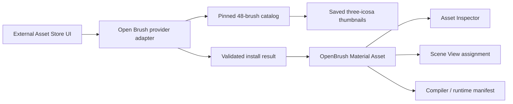

# Open Brush Material Provider 設計

## ステータス

- 対象機能: F-21 外部 Asset Store / F-18 OpenBrush import
- 参照: MI-03, MI-04, MI-05, MI-09, MI-15, MI-21, MI-49, MI-52
- 状態: 設計済み、未実装

## ユーザーが得たい結果

Visual Editor の Assets から Open Brush の特定ブラシを見た目で選び、再利用可能な Material Asset として現在のプロジェクトへ追加する。

## 入口と情報設計

Assets header の「外部から追加」は維持し、ダイアログ左の provider sidebar へ Open Brush を Poly Haven と同じ階層で追加する。Open Brush を Poly Haven の Material filter や下位カテゴリにはしない。

```text
外部リソースを追加
┌────────────────┬──────────────────────────┬───────────────────┐
│ リソース集       │ Open Brush               │ 選択したMaterial    │
│                │ [検索................]    │ [実ストロークPreview]│
│ Poly Haven     │ [すべて][描画][発光][形状] │ OilPaint           │
│ Open Brush  選択│                          │ Apache-2.0          │
│                │ [OilPaint] [Ink]          │ three-icosa対応      │
│                │ [Fire]     [Light]        │                   │
│                │ [Comet]    [Wire]         │ [Materialを追加]    │
└────────────────┴──────────────────────────┴───────────────────┘
```

provider の表示順は、既存の Poly Haven、その直下に Open Brush とする。双方のカードの大きさ、選択表現、badge の位置は揃える。

| 項目 | Poly Haven | Open Brush |
| --- | --- | --- |
| provider badge | CC0 | Apache-2.0 |
| 主な対象 | HDRI、PBR Material | Open Brush Material |
| 取得単位 | 解像度と形式を選ぶファイル | version 固定のブラシ preset |
| 主操作 | プロジェクトへインストール | Material を追加 |
| preview | 配布元 thumbnail | 実ストロークを three-icosa で描画 |

## カタログの範囲

最初のリリースでは、XRift Studio に固定している `three-icosa` の `all_brushes.glb` に含まれ、代表ストローク形状と `GOOGLE_tilt_brush_material` GUID の両方を確認できる 48 Material を表示する。

同梱の brush resource directory に存在するだけで代表形状がない preset、Open Brush の experimental brush、現在の three-icosa で再現を検証していない brush は表示しない。「Open Brush の全ブラシ」ではなく「XRift Studio で検証済みの 48 ブラシ」と明記する。

各 catalog entry は次を持つ。

- provider ID: `open-brush`
- 安定 ID: brush GUID
- 表示名と three-icosa が解決する brush name
- source material index と代表 source node index
- 検索用カテゴリと tag
- renderer name / version
- catalog source revision
- 配布ページ、license 名、license URL
- preview / thumbnail の状態

同名 brush が複数 revision に存在しても、GUID を同一性の基準にする。GUID が異なるものは別 Material として扱う。

## Preview

Open Brush shader は通常の球体や平面に貼るだけでは、元ストロークが持つ attribute を再現できない場合がある。カタログでは CSS 図形、色見本、汎用 sphere を Material の見た目として使わない。

- 一覧 thumbnail は、固定した `all_brushes.glb` から entry の代表 node だけを分離し、同梱 brush library と three-icosa で実描画して全48件の保存済みWebPを生成する。
- 一覧と右詳細はGUIDをキーに同じ保存画像を表示し、Storeを開くだけではWebGL Canvasを作らない。
- renderer、catalog revision、代表nodeの対応を変更した時だけ固定generatorで全件を再生成する。
- shader resource 不足、compile error、attribute 不一致では PBR fallback を成功表示にせず、生成工程を失敗させる。
- 保存済みthumbnailが欠落または破損している場合はMaterial名、brush icon、「Preview unavailable」を即時表示し、「Previewを生成中」のままにしない。

## 選択した Material の詳細

右詳細には次を表示する。

1. 保存済み実ストローク thumbnail
2. Material 名
3. 分類 tag。例: 描画、発光、半透明、粒子表現、形状
4. provider、作者、Apache-2.0、配布元への link
5. `three-icosa` renderer version と catalog revision
6. 「ストローク向け Material。Mesh attribute により見た目が変わります」という互換性説明
7. 主操作「Material を追加」

Open Brush には解像度選択がないため、Poly Haven の「解像度」「ファイル形式」「ダウンロード目安」は表示しない。代わりに「収録版: XRift Studio 検証済み」と renderer version を読み取り専用で表示する。

## 状態設計

### 操作前

- ダイアログを開いた時は既存どおり Poly Haven を初期選択にする。Open Brush は左 sidebar から一操作で選べる。
- provider を切り替えた時は検索、カテゴリ、選択中 Material を provider ごとに保持する。同じダイアログ内の Scene、Asset selection、camera は変更しない。
- Open Brush の初期選択は catalog の先頭とし、右詳細で live preview を開始する。
- project 未保存、Play 中、別の Asset transaction 中は理由を表示して「Material を追加」を無効にする。

### 処理中

- 主操作を「追加中」に変え、provider 切替、Material 切替、閉じる操作、二重実行を無効にする。
- install request は任意 URL や shader source を受け取らず、provider ID、brush GUID、catalog revision だけを native/provider 境界へ渡す。
- provider 側で GUID と revision を固定 catalog に照合してから Material descriptor を返す。
- AssetManifest への反映は一件の history transaction にし、途中失敗では Material を作らない。

### 成功時

- `External/Open Brush` folder に Material Asset を一件作る。
- Material は brush name、GUID、renderer version、brush resource base、source material index、provider attribution を保持する。
- Scene や Mesh へ自動割り当てしない。新しい Material を `assetSelection` にし、右 Asset Inspector で実 preview と互換性を確認できる状態にする。
- 同じ provider、GUID、renderer version の Material が既にあれば複製せず、既存 Material を選択して「追加済みです」と表示する。
- 成功面には「Assets で開く」を主操作、「続けて追加」を副操作として残す。「Assets で開く」はダイアログを閉じ、選択済み Material Inspector へ到達させる。

### 失敗時

- catalog 読み込み失敗では Open Brush の選択、検索、カテゴリを保持し、中央領域から再試行できる。
- preview 失敗は install 可否と分ける。実 renderer で確認できない事実を表示し、preview の再試行を用意する。
- GUID 不一致、未対応 preset、renderer version 不一致、Asset 保存失敗では追加を完了扱いにしない。
- install 失敗では AssetManifest、Scene、両 selection、history を変更せず、同じ Material から再試行できる。

### 戻り先

- 取消ではダイアログを開く前の Visual Editor、Scene selection、Asset selection、camera へ戻る。
- 成功後の「Assets で開く」では追加または検出した Material を選択し、Inspector まで到達する。

## 保存モデル

Open Brush は PBR texture set ではないため、Poly Haven の Texture 展開処理へ寄せず、`MaterialAsset.shader.kind = "openbrush"` を使う。

```ts
type OpenBrushCatalogEntry = {
  providerId: "open-brush";
  externalId: string; // brush GUID
  name: string;
  brushName: string;
  sourceMaterialIndex: number;
  sourceNodeIndex: number;
  category: "paint" | "drawing" | "light-effect" | "shape";
  tags: string[];
  renderer: "three-icosa";
  rendererVersion: string;
  catalogRevision: string;
  assetUrl: string;
  licenseName: "Apache-2.0";
  licenseUrl: string;
};
```

作成する Material Asset の ID は `external-open-brush-{guid}-material` を基準に決定し、文字列の表示名に依存させない。attribution は既存の `AssetAttribution` に provider、作者、source URL、license を保存する。

初期実装では、エディターは XRift Studio に同梱した固定 brush library を使い、生成 runtime は Material に保存した固定 renderer version と brush resource base を使う。ユーザー指定 URL や任意 GLSL の取得はこの入口では許可しない。将来 project-owned resource を発行する場合も、同じ catalog ID と Material descriptor を保ち、compiler の resource 解決だけを差し替える。

## レイヤー境界



- UI は provider 固有の GUID table、license 文言、renderer resource path を持たない。
- provider adapter は catalog、option、attribution、install result を共通 contract へ変換する。
- Asset 作成は既存の `applyExternalStoreInstall` 境界で分岐し、VisualEditor コンポーネントへ Open Brush 固有処理を散在させない。
- custom Material preview は元 Model を持つ import Material と、catalog から追加した standalone Material の双方を同じ adapter で表示する。

## 実装順

1. provider metadata と共通 contract に `material` / Open Brush preview descriptor を追加する。
2. 固定 48-brush catalog と GUID 検証を provider adapter に追加する。
3. provider sidebar へ Open Brush を Poly Haven と同列で追加する。
4. 代表 node を使う固定thumbnail generatorとGUID単位の保存画像を追加する。
5. standalone Open Brush Material の install と重複検出を追加する。
6. 成功後の `assetSelection`、Inspector、Undo / Redo、save / reopen を確認する。
7. compiler と runtime で同じ brush name、GUID、renderer version が使われることを確認する。

## 受け入れ条件

- Open Brush が Poly Haven と同じ provider sidebar 階層に表示される。
- 検証済み Material を名前、カテゴリ、tag で絞り込める。
- 選択した Material の実ストローク preview、license、renderer version を追加前に確認できる。
- 一回の操作で一つの OpenBrush Material Asset が作られ、Scene を自動変更しない。
- 追加後はその Material が選択され、Inspector から実 preview と attribution を確認できる。
- 同じ brush の再追加で不要な複製を作らない。
- 処理中、失敗、取消で二重実行や不完全な AssetManifest 更新が起きない。
- save / reopen、Undo / Redo、Scene への Material 割り当て、compile 後も GUID と renderer version を保持する。

## 今回含めないもの

- Open Brush の全 experimental brush の自動追従
- 任意 URL からの brush shader / GLSL import
- 複数 Material の一括追加
- Open Brush アプリへ brush preset を逆 export する機能
- Material 追加と同時に Mesh や Scene を自動作成する機能

## 固定ソース

- [Open Brush](https://github.com/icosa-foundation/open-brush)
- [three-icosa](https://github.com/icosa-foundation/three-icosa)
- [XRift Studio に同梱した brush library の由来](../public/visual-editor/openbrush/SOURCE.md)
- [XRift Studio の第三者 Asset 記録](../THIRD_PARTY_ASSETS.md)
