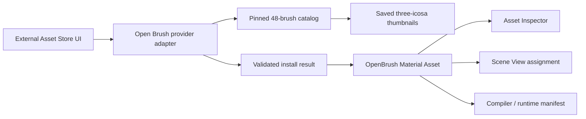

# Open Brushマテリアル Provider 設計

## ステータス

- 対象機能: F-21 外部素材 Store / F-18 OpenBrush import
- 参照: MI-03, MI-04, MI-05, MI-09, MI-15, MI-21, MI-49, MI-52
- 状態: 設計済み、未実装

## ユーザーが得たい結果

ビジュアルエディターの素材からOpen Brushの特定ブラシを見た目で選ぶ。再利用可能なマテリアルとして現在のプロジェクトへ追加する。

## 入口と情報設計

素材 header の「外部から追加」は維持する。ダイアログ左の provider sidebar へOpen Brushを Poly Haven と同じ階層で追加する。Open Brushを Poly Haven のマテリアル filter や下位カテゴリにはしない。

```text
外部リソースを追加
┌────────────────┬──────────────────────────┬───────────────────┐
│ リソース集       │ Open Brush               │ 選択したMaterial    │
│                │ [検索................]    │ [実ストロークPreview]│
│ Poly Haven     │ [すべて][描画][発光][形状] │ OilPaint           │
│ Open Brush  選択│                          │ Apache-2.0          │
│                │ [OilPaint] [Ink]          │ three-icosa対応      │
│                │ [Fire]     [Light]        │                   │
│                │ [Comet]    [Wire]         │ [Materialを追加]    │
└────────────────┴──────────────────────────┴───────────────────┘
```

provider の表示順は、既存の Poly Haven、その直下にOpen Brushとする。双方のカードの大きさ、選択表現、badge の位置は揃える。

| 項目 | Poly Haven | Open Brush |
| --- | --- | --- |
| provider badge | CC0 | Apache-2.0 |
| 主な対象 | HDRI、PBR マテリアル | Open Brushマテリアル |
| 取得単位 | 解像度と形式を選ぶファイル | version 固定のブラシプリセット |
| 主操作 | プロジェクトへインストール | マテリアルを追加 |
| preview | 配布元 thumbnail | 実ストロークを three-icosa で描画 |

## カタログの範囲

最初のリリースでは、XRift Studio に固定している `three-icosa` の `all_brushes.glb` に含まれ、代表ストローク形状と `GOOGLE_tilt_brush_material` GUID の両方を確認できる 48 マテリアルを表示する。

同梱の brush resource directory に存在するだけで代表形状がないプリセット、Open Brushの experimental brush、現在の three-icosa で再現を検証していない brush は表示しない。「Open Brushの全ブラシ」ではなく「XRift Studio で検証済みの 48 ブラシ」と明記する。

各 catalog 開始ファイルは次を持つ。

- provider ID: `open-brush`
- 安定 ID: brush GUID
- 表示名と three-icosa が解決する brush name
- 元データ material index と代表元データノード index
- 検索用カテゴリと tag
- renderer name / version
- catalog source revision
- 配布ページ、license 名、license URL
- preview / thumbnail の状態

同名 brush が複数 revision に存在しても、GUID を同一性の基準にする。GUID が異なるものは別マテリアルとして扱う。

## Preview

Open Brushシェーダーは通常の球体や平面に貼るだけでは、元ストロークが持つ attribute を再現できない場合がある。カタログでは CSS 図形、色見本、汎用 sphere をマテリアルの見た目として使わない。

- 一覧 thumbnail は、固定した `all_brushes.glb` から開始ファイルの代表ノードだけを分離する。同梱 brush library と three-icosa で実描画し、全 48 件の保存済み WebP を生成する
- 一覧と右詳細は GUID をキーに同じ保存画像を表示する。Store を開くだけでは WebGL Canvas を作らない
- renderer、catalog revision、代表ノードの対応を変更した時だけ、固定 generator で全件を再生成する
- シェーダー resource 不足、compile error、attribute 不一致では PBR fallback を成功表示にしない。生成工程を失敗させる
- 保存済み thumbnail が欠落または破損している場合はマテリアル名、brush icon、「プレビュー unavailable」を即時表示する。「プレビューを生成中」のままにはしない

## 選択したマテリアルの詳細

右詳細には次を表示する。

1. 保存済み実ストローク thumbnail
2. マテリアル名
3. 分類 tag。例: 描画、発光、半透明、粒子表現、形状
4. provider、作者、Apache-2.0、配布元への link
5. `three-icosa` renderer version と catalog revision
6. 「ストローク向けマテリアル。メッシュ attribute により見た目が変わります」という互換性説明
7. 主操作「マテリアルを追加」

Open Brushには解像度選択がない。このため、Poly Haven の「解像度」「ファイル形式」「ダウンロード目安」は表示しない。代わりに「収録版: XRift Studio 検証済み」と renderer version を読み取り専用で表示する。

## 状態設計

### 操作前

- ダイアログを開いた時は既存どおり Poly Haven を初期選択にする。Open Brushは左 sidebar から一操作で選べる
- provider を切り替えた時は検索、カテゴリ、選択中マテリアルを provider ごとに保持する。同じダイアログ内のシーン、素材 selection、camera は変更しない
- Open Brushの初期選択は catalog の先頭とする。右詳細で live preview を開始する
- project 未保存、動作確認中、別の素材 transaction 中は理由を表示する。「マテリアルを追加」は無効にする

### 処理中

- 主操作を「追加中」に変える。provider 切替、マテリアル切替、閉じる操作、二重実行を無効にする
- install request は任意 URL やシェーダー元データを受け取らない。provider ID、brush GUID、catalog revision だけを native/provider 境界へ渡す
- provider 側で GUID と revision を固定 catalog に照合する。その後にマテリアル descriptor を返す
- AssetManifest への反映は一件の history transaction にする。途中失敗ではマテリアルを作らない

### 成功時

- `External/Open Brush` folder にマテリアルを一件作る。
- マテリアルは brush name、GUID、renderer version、brush resource base、元データ material index、provider attribution を保持する。
- シーンやメッシュへ自動割り当てしない。新しいマテリアルを `assetSelection` にする。右素材設定で実 preview と互換性を確認できる状態にする
- 同じ provider、GUID、renderer version のマテリアルが既にあれば複製しない。既存マテリアルを選択し、「追加済みです」と表示する
- 成功面には「素材で開く」を主操作として残す。「続けて追加」を副操作として残す。「素材で開く」はダイアログを閉じる。選択済みマテリアル設定へ到達させる

### 失敗時

- catalog 読み込み失敗ではOpen Brushの選択、検索、カテゴリを保持する。中央領域から再試行できる
- preview 失敗は install 可否と分ける。実 renderer で確認できない事実を表示する。preview の再試行を用意する
- GUID 不一致、未対応プリセット、renderer version 不一致、素材保存失敗では追加を完了扱いにしない。
- install 失敗では AssetManifest、シーン、両 selection、history を変更しない。同じマテリアルから再試行できる

### 戻り先

- 取消ではダイアログを開く前のビジュアルエディター、シーン selection、素材 selection、camera へ戻る。
- 成功後の「素材で開く」では追加または検出したマテリアルを選択する。設定まで到達する。

## 保存モデル

Open Brushは PBR texture set ではない。このため、Poly Haven のテクスチャ展開処理へ寄せず、`MaterialAsset.shader.kind = "openbrush"` を使う。

```ts
type OpenBrushCatalogEntry = {
  providerId: "open-brush";
  externalId: string; // brush GUID
  name: string;
  brushName: string;
  sourceMaterialIndex: number;
  sourceNodeIndex: number;
  category: "paint" | "drawing" | "light-effect" | "shape";
  tags: string[];
  renderer: "three-icosa";
  rendererVersion: string;
  catalogRevision: string;
  assetUrl: string;
  licenseName: "Apache-2.0";
  licenseUrl: string;
};
```

作成するマテリアルの ID は `external-open-brush-{guid}-material` を基準に決定する。文字列の表示名には依存させない。attribution は既存の `AssetAttribution` に provider、作者、元データ URL、license を保存する。

エディターは XRift Studio に同梱した固定 brush library を使う。生成実行環境はマテリアルに保存した固定 renderer version と brush resource base を使う。ユーザー指定 URL や任意 GLSL の取得はこの入口では許可しない。将来 project-owned resource を発行する場合も、同じ catalog ID とマテリアル descriptor を保つ。compiler の resource 解決だけを差し替える。

## レイヤー境界


```mermaid
flowchart LR
  A["External Asset Store UI"] --> B["Open Brush provider adapter"]
  B --> C["Pinned 48-brush catalog"]
  C --> D["Saved three-icosa thumbnails"]
  B --> E["Validated install result"]
  E --> F["OpenBrush Material Asset"]
  F --> G["Asset Inspector"]
  F --> H["Scene View assignment"]
  F --> I["Compiler / runtime manifest"]
```

- UI は provider 固有の GUID table、license 文言、renderer resource path を持たない。
- provider adapter は catalog、option、attribution、install result を共通 contract へ変換する。
- 素材作成は既存の `applyExternalStoreInstall` 境界で分岐する。VisualEditor コンポーネントへOpen Brush固有処理を散在させない。
- custom マテリアル preview は元 3Dモデルを持つ import マテリアルと、catalog から追加した standalone マテリアルの双方を同じ adapter で表示する。

## 実装順

1. provider metadata と共通 contract に `material` / Open Brush preview descriptor を追加する。
2. 固定 48-brush catalog と GUID 検証を provider adapter に追加する。
3. provider sidebar へOpen Brushを Poly Haven と同列で追加する。
4. 代表ノードを使う固定 thumbnail generator と GUID 単位の保存画像を追加する。
5. standalone Open Brushマテリアルの install と重複検出を追加する。
6. 成功後の `assetSelection`、設定、元に戻す / やり直す、save / reopen を確認する。
7. compiler と実行環境で同じ brush name、GUID、renderer version が使われることを確認する。

## 受け入れ条件

- Open Brushが Poly Haven と同じ provider sidebar 階層に表示される。
- 検証済みマテリアルを名前、カテゴリ、tag で絞り込める。
- 選択したマテリアルの実ストローク preview、license、renderer version を追加前に確認できる。
- 一回の操作で一つの OpenBrush マテリアルが作られる。シーンは自動変更しない。
- 追加後はそのマテリアルが選択される。設定から実 preview と attribution を確認できる。
- 処理中、失敗、取消で二重実行や不完全な AssetManifest 更新が起きない。
- save / reopen、元に戻す / やり直す、シーンへのマテリアル割り当て、compile 後も GUID と renderer version を保持する。

## この入口で扱わないもの

- Open Brushの全 experimental brush の自動追従
- 任意 URL からの brush シェーダー / GLSL import
- 複数マテリアルの一括追加
- Open Brushアプリへ brush プリセットを逆 export する機能
- マテリアル追加と同時にメッシュやシーンを自動作成する機能

## 固定ソース

- [Open Brush](https://github.com/icosa-foundation/open-brush)
- [three-icosa](https://github.com/icosa-foundation/three-icosa)
- [XRift Studio に同梱した brush library の由来](../public/visual-editor/openbrush/SOURCE.md)
- [XRift Studio の第三者素材記録](../THIRD_PARTY_ASSETS.md)
