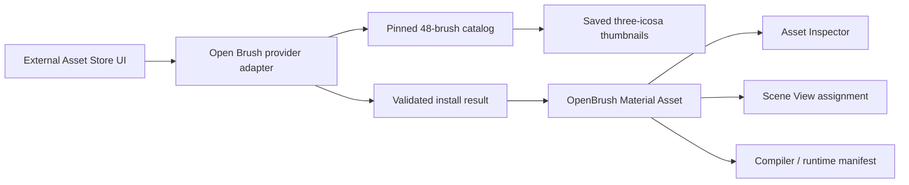

# Open Brushマテリアル Provider 設計

## ステータス

- 対象機能: F-21外部素材Store / F-18 OpenBrush import
- 参照: MI-03, MI-04, MI-05, MI-09, MI-15, MI-21, MI-49, MI-52
- 状態: 設計記録。現在はカタログ・外部素材プロバイダーの実装あり。詳細な対応範囲は`src/lib/visual-editor/open-brush-catalog.ts`、`external-store-providers.ts`、`external-store.ts`と照合する。

## ユーザーが得たい結果

ビジュアルエディターの素材からOpen Brushの特定ブラシを見た目で選ぶ。再利用可能なマテリアルとして現在のプロジェクトへ追加する。

## 入口と情報設計

素材の見出しにある「外部から追加」は維持する。ダイアログ左のプロバイダー一覧では、Open BrushをPoly Havenと同じ階層に追加する。Poly Havenのマテリアル絞り込みや下位カテゴリには含めない。

```text
外部リソースを追加
┌────────────────┬──────────────────────────┬───────────────────┐
│ リソース集       │ Open Brush               │ 選択したMaterial    │
│                │ [検索................]    │ [実ストロークPreview]│
│ Poly Haven     │ [すべて][描画][発光][形状] │ OilPaint           │
│ Open Brush  選択│                          │ Apache-2.0          │
│                │ [OilPaint] [Ink]          │ three-icosa対応      │
│                │ [Fire]     [Light]        │                   │
│                │ [Comet]    [Wire]         │ [Materialを追加]    │
└────────────────┴──────────────────────────┴───────────────────┘
```

プロバイダー一覧では、既存のPoly Havenの直下にOpen Brushを表示する。カードの大きさ、選択時の表示、バッジの位置は双方で揃える。

| 項目 | Poly Haven | Open Brush |
| --- | --- | --- |
| provider badge | CC0 | Apache-2.0 |
| 主な対象 | HDRI、PBRマテリアル | Open Brushマテリアル |
| 取得単位 | 解像度と形式を選ぶファイル | version固定のブラシプリセット |
| 主操作 | プロジェクトへインストール | マテリアルを追加 |
| preview | 配布元thumbnail | 実ストロークをthree-icosaで描画 |

## カタログの範囲

最初のリリースでは、XRift Studioに固定している`three-icosa`の`all_brushes.glb`に含まれ、代表ストローク形状と`GOOGLE_tilt_brush_material` GUIDの両方を確認できる48マテリアルを表示する。

同梱のブラシリソースに含まれていても、代表形状がないプリセットは表示しない。Open Brushの実験段階のブラシや、現在のthree-icosaで再現を検証していないブラシも対象から除く。「Open Brushの全ブラシ」ではなく「XRift Studioで検証済みの48ブラシ」と明記する。

カタログの各項目には、次の情報を持たせる。

- provider ID: `open-brush`
- 安定ID: brush GUID
- 表示名とthree-icosaが解決するbrush name
- 元データmaterial indexと代表元データノードindex
- 検索用カテゴリとtag
- renderer name / version
- catalog source revision
- 配布ページ、license名、license URL
- preview / thumbnailの状態

複数のリビジョンに同名のブラシがあっても、GUIDで同じブラシかどうかを判定する。GUIDが異なるものは別マテリアルとして扱う。

## Preview

Open Brushシェーダーは通常の球体や平面に貼るだけでは、元ストロークが持つattributeを再現できない場合がある。カタログではCSS図形、色見本、汎用sphereをマテリアルの見た目として使わない。

- 一覧thumbnailは、固定した`all_brushes.glb`から各項目の代表ノードだけを分離する。同梱brush libraryとthree-icosaで実描画し、全48件の保存済みWebPを生成する
- 一覧と右詳細はGUIDをキーに同じ保存画像を表示する。Storeを開くだけではWebGL Canvasを作らない
- renderer、catalog revision、代表ノードの対応を変更した時だけ、固定generatorで全件を再生成する
- シェーダーresource不足、compile error、attribute不一致ではPBR fallbackを成功表示にしない。生成工程を失敗させる
- 保存済みサムネイルが欠落または破損している場合は、マテリアル名、ブラシアイコン、プレビューを表示できない旨をすぐに表示する。「プレビューを生成中」のままにはしない

## 選択したマテリアルの詳細

右詳細には次を表示する。

1. 保存済み実ストロークthumbnail
2. マテリアル名
3. 分類tag。例: 描画、発光、半透明、粒子表現、形状
4. provider、作者、Apache-2.0、配布元へのlink
5. `three-icosa` renderer versionとcatalog revision
6. 「ストローク向けマテリアル。メッシュattributeにより見た目が変わります」という互換性説明
7. 主操作「マテリアルを追加」

Open Brushには解像度選択がないため、Poly Havenの「解像度」「ファイル形式」「ダウンロード目安」は表示しない。「収録版: XRift Studio検証済み」と描画ライブラリーのバージョンを読み取り専用で表示する。

## 状態設計

### 操作前

- ダイアログを開いた時は既存どおりPoly Havenを初期選択にする。Open Brushは左sidebarから一操作で選べる
- providerを切り替えた時は検索、カテゴリ、選択中マテリアルをproviderごとに保持する。同じダイアログ内のシーン、素材selection、cameraは変更しない
- Open Brushではカタログの先頭を初期選択とし、右の詳細欄でライブプレビューを開始する
- プロジェクトが未保存の場合、動作確認中、別の素材処理中は理由を表示し、「マテリアルを追加」を無効にする

### 処理中

- 主操作を「追加中」に変える。provider切替、マテリアル切替、閉じる操作、二重実行を無効にする
- install requestは任意URLやシェーダー元データを受け取らない。provider ID、brush GUID、catalog revisionだけをnative/provider境界へ渡す
- provider側でGUIDとrevisionを固定catalogに照合する。その後にマテリアルdescriptorを返す
- AssetManifestへの反映は一件のhistory transactionにする。途中失敗ではマテリアルを作らない

### 成功時

- `External/Open Brush` folderにマテリアルを一件作る。
- マテリアルはbrush name、GUID、renderer version、brush resource base、元データmaterial index、provider attributionを保持する。
- シーンやメッシュへ自動割り当てしない。新しいマテリアルを`assetSelection`にする。右の素材設定で実際のプレビューと互換性を確認できる状態にする
- 同じprovider、GUID、renderer versionのマテリアルが既にあれば複製しない。既存マテリアルを選択し、「追加済みです」と表示する
- 成功時は「素材で開く」を主操作、「続けて追加」を副操作として表示する。「素材で開く」を押すとダイアログを閉じ、選択したマテリアルの設定を表示する

### 失敗時

- catalog読み込み失敗ではOpen Brushの選択、検索、カテゴリを保持する。中央領域から再試行できる
- preview失敗はinstall可否と分ける。実rendererで確認できない事実を表示する。previewの再試行を用意する
- GUID不一致、未対応プリセット、renderer version不一致、素材保存失敗では追加を完了扱いにしない。
- install失敗ではAssetManifest、シーン、両selection、historyを変更しない。同じマテリアルから再試行できる

### 戻り先

- 取消ではダイアログを開く前のビジュアルエディター、シーンselection、素材selection、cameraへ戻る。
- 成功後に「素材で開く」を押すと、追加したマテリアル、または重複検出した既存のマテリアルを選択し、その設定を表示する。

## 保存モデル

Open Brushには、ブラシのシェーダーとストローク属性に対応した処理が必要になる。保存には`MaterialAsset.shader.kind = "openbrush"`を使い、Poly HavenのPBRテクスチャ展開処理とは分ける。

```ts
type OpenBrushCatalogEntry = {
  providerId: "open-brush";
  externalId: string; // brush GUID
  name: string;
  brushName: string;
  sourceMaterialIndex: number;
  sourceNodeIndex: number;
  category: "paint" | "drawing" | "light-effect" | "shape";
  tags: string[];
  renderer: "three-icosa";
  rendererVersion: string;
  catalogRevision: string;
  assetUrl: string;
  licenseName: "Apache-2.0";
  licenseUrl: string;
};
```

作成するマテリアルのIDは`external-open-brush-{guid}-material`を基準に決定する。文字列の表示名には依存させない。attributionは既存の`AssetAttribution`にprovider、作者、元データURL、licenseを保存する。

エディターはXRift Studioに同梱した固定brush libraryを使う。生成実行環境はマテリアルに保存した固定renderer versionとbrush resource baseを使う。ユーザー指定URLや任意GLSLの取得はこの入口では許可しない。将来project-owned resourceを発行する場合も、同じcatalog IDとマテリアルdescriptorを保つ。compilerのresource解決だけを差し替える。

## レイヤー境界


```mermaid
flowchart LR
  A["External Asset Store UI"] --> B["Open Brush provider adapter"]
  B --> C["Pinned 48-brush catalog"]
  C --> D["Saved three-icosa thumbnails"]
  B --> E["Validated install result"]
  E --> F["OpenBrush Material Asset"]
  F --> G["Asset Inspector"]
  F --> H["Scene View assignment"]
  F --> I["Compiler / runtime manifest"]
```

- UIはprovider固有のGUID table、license文言、renderer resource pathを持たない。
- provider adapterはcatalog、option、attribution、install resultを共通contractへ変換する。
- 素材作成は既存の`applyExternalStoreInstall`境界で分岐する。VisualEditorコンポーネントへOpen Brush固有処理を散在させない。
- customマテリアルpreviewは元3Dモデルを持つimportマテリアルと、catalogから追加したstandaloneマテリアルの双方を同じadapterで表示する。

## 実装順

1. provider metadataと共通contractに`material` / Open Brush preview descriptorを追加する。
2. 固定48-brush catalogとGUID検証をprovider adapterに追加する。
3. provider sidebarへOpen BrushをPoly Havenと同列で追加する。
4. 代表ノードを使う固定thumbnail generatorとGUID単位の保存画像を追加する。
5. standalone Open Brushマテリアルのinstallと重複検出を追加する。
6. 成功後の`assetSelection`、設定、元に戻す / やり直す、save / reopenを確認する。
7. compilerと実行環境で同じbrush name、GUID、renderer versionが使われることを確認する。

## 受け入れ条件

- Open BrushがPoly Havenと同じprovider sidebar階層に表示される。
- 検証済みマテリアルを名前、カテゴリ、tagで絞り込める。
- 選択したマテリアルの実ストロークpreview、license、renderer versionを追加前に確認できる。
- 一回の操作で一つのOpenBrushマテリアルが作られる。シーンは自動変更しない。
- 追加後はそのマテリアルが選択される。設定から実際のプレビューと出典を確認できる。
- 処理中、失敗、取消で二重実行や不完全なAssetManifest更新が起きない。
- save / reopen、元に戻す / やり直す、シーンへのマテリアル割り当て、compile後もGUIDとrenderer versionを保持する。

## この入口で扱わないもの

- Open Brushの全experimental brushの自動追従
- 任意URLからのbrushシェーダー / GLSL import
- 複数マテリアルの一括追加
- Open Brushアプリへbrushプリセットを逆exportする機能
- マテリアル追加と同時にメッシュやシーンを自動作成する機能

## 固定ソース

- [Open Brush](https://github.com/icosa-foundation/open-brush)
- [three-icosa](https://github.com/icosa-foundation/three-icosa)
- [XRift Studioに同梱したbrush libraryの由来](../public/visual-editor/openbrush/SOURCE.md)
- [XRift Studioの第三者素材記録](../THIRD_PARTY_ASSETS.md)
