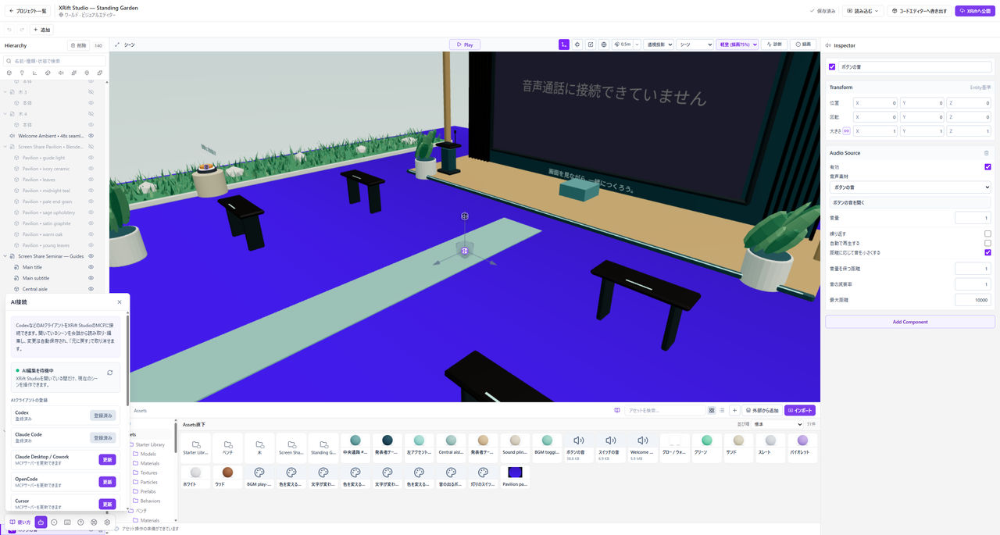

# AIに編集を手伝ってもらう

AI接続は、基本の制作に必須ではありません。まず[最初のワールド](./first-world.md)を作り、保存とPlayの操作を覚えてから使うと、AIの変更も確かめやすくなります。

*AI接続は保存してから開きます。接続状態を確認してから小さな変更を頼みます。*

## 接続前に保存する

AIは配置や設定を変更します。残したい状態を保存し、大きな変更を頼む場合はプロジェクトを複製しておいてください。

## AI接続を開く

エディター左下の**AI接続**を開きます。対応するAIクライアントの一覧と接続状態を確認し、使うものを選んで登録します。

接続に使う仕組みを**MCP**と呼びます。登録後にAIクライアントの再読み込みなどを求められた場合は、画面の案内に従ってください。ボタンを押しただけで接続済みと判断せず、表示された状態を確認します。

AIサービスの契約や利用料金、モデルの選択は、XRift Studioのアプリ配布とは別です。

## 最初は小さな変更を頼む

たとえば「選んだ球の位置は変えず、色だけを青にしてください」のように、対象と変える内容を指定します。

変更後は、HierarchyとInspectorで対象を確認し、**Play**で見た目や動作を確かめます。目的と違えば、元に戻せる範囲で取り消すか、バックアップへ戻ります。

## 依頼に含めること

作りたい見た目、変更してよい範囲、残したいものを伝えます。公開や削除など、戻しにくい操作を意図せず含めないようにしてください。

AIが「できた」と説明しても、保存や公開が完了したとは限りません。実際の画面で状態と結果を確認してください。

## 接続できないとき

AI接続の表示を確認し、必要なクライアントの再起動や登録のやり直しを行います。原因が分からない場合は[復旧と問い合わせ](./recovery.md)へ進んでください。認証情報や秘密のキーは、問い合わせに含めないでください。
