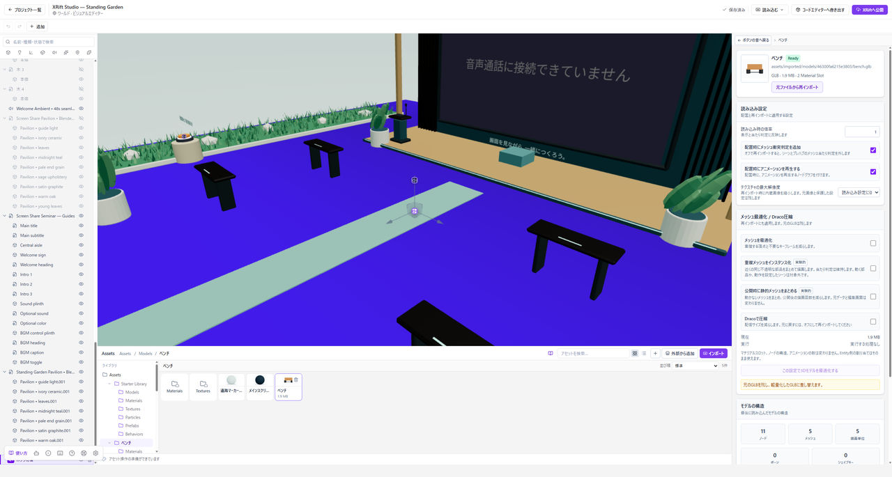

# モデルや画像を取り込む

ファイルをAssetsに追加してから、シーンへの配置やマテリアルへの割り当てに使います。

*取り込んだファイルはAssetsに集まります。シーンへドラッグすると配置できます。*

## 3Dモデルを取り込む

1. **Assets → インポート**からファイルを選ぶか、Assetsへファイルをドラッグします。
2. 読み込み設定が表示されたら、モデルの内容と取り込み結果を確認します。
3. Assetsに追加されたモデルを、中央のシーンへドラッグします。
4. Hierarchyで配置したEntityを選び、大きさと位置を調整します。

最初は、モデルと必要な素材を一つにまとめた**GLB**から始めると、関連ファイルの選び忘れを減らせます。GLTFなど外部画像を参照する形式では、参照先のファイルも必要です。

モデルを追加しただけではシーンに現れません。**取り込み**と**配置**の二つを行ってください。

## 画像・音声を取り込む

画像や音声もAssetsから追加します。画像はマテリアルの模様や背景、音声は音源などで使います。

画像を取り込むだけでは、モデルに模様は付きません。[テクスチャを貼る](./textures.md)で、どの欄へ割り当てるかを確認してください。音の設定は[音を鳴らす](./audio.md)へ進みます。

## モデルが小さい・大きい

Hierarchyで配置したEntityを選び、**F**で視点を合わせます。見つかれば、Inspectorの大きさを調整します。モデル側の単位や原点によって、見える位置や大きさは変わります。

見えるようになってから床との位置関係を確認してください。カメラを極端に近づけるだけで、大きさの問題を解決しようとしないでください。

## 色や質感を変える

配置したモデルを選び、**Mesh Renderer**でマテリアルの割り当てを確認します。モデルに複数のマテリアルスロットがある場合は、変更したい面のスロットを選んでください。

モデル由来のマテリアルには、再インポート時の扱いがInspectorに表示されます。変更前にその表示を確認し、大きな差し替えの前にはバックアップしてください。

## ファイルを差し替える前に

プロジェクトを[ファイルに書き出す](./save-and-open.md#バックアップする)などして残します。取り込み済みの素材を先に削除すると、シーンの参照が外れる場合があります。削除画面の使用箇所を確認してください。

画面に読み込みエラーが出ている場合は、その内容を確認してからやり直します。Assetsに項目だけ増えたことを、取り込み成功の判断にはしないでください。

## VehicleとSeatを追加する

**外部から追加 → XRift公式コンポーネント**を開き、VehicleまたはSeatのカードを選びます。**Vehicleをシーンへ追加**または**Seatをシーンへ追加**を押すと、車体や椅子が操作に必要な設定と一緒に配置されます。

Hierarchyで位置を調整したら、そのまま[Playで運転や着席を試せます](./play-mode.md#vehicleとseatを試す)。配置や設定の変更は自動保存されます。
