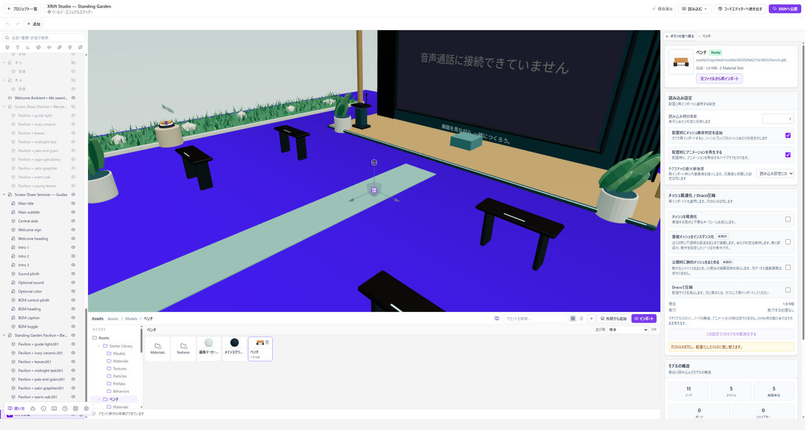

# モデルや画像を取り込む

動画で操作を確認する：[外部GLBを読み込んで配置する](./lesson-02-01.md)

モデル、画像、音声はAssetsに取り込んで使います。モデルはシーンに配置し、画像はマテリアルなどに割り当ててください。

*取り込んだモデルはAssetsに表示されます。シーンへドラッグして配置してください。*

## 3Dモデルを取り込む

「Assets → ファイルから素材を追加」でファイルを選ぶか、Assetsへファイルをドラッグしてください。読み込み設定が表示されたら、モデルの内容と取り込み結果を確認します。

取り込んだモデルをAssetsから中央のシーンへドラッグすると、配置できます。HierarchyでそのEntityを選び、大きさと位置を調整してください。

GLBはモデルと必要な素材を一つのファイルにまとめられるため、初めての取り込みに使いやすい形式です。GLTFなどで外部の画像を参照している場合は、参照先のファイルも用意してください。

Assetsへの取り込みが終わったら、シーンへの配置も行ってください。取り込んだだけでは、シーンには表示されません。

## VRMアバターを取り込む

VRM 0.xとVRM 1.0の`.vrm`ファイルは、通常の3Dモデルと同じ方法で取り込めます。取り込み後は、Assetsからシーンへドラッグして配置してください。

モデルのフォルダー内のMaterialsでマテリアルを選ぶと、Inspectorで色や輪郭線を変えられます。VRM 0.xのMToonは「MToon 0.x」、VRM 1.0のMToonは「MToon 1.0」と表示されます。どちらもShade Color、Outline Color、Outline Widthで調整でき、「マテリアルの種類」で切り替えられます。詳しくは[MToonの陰影と輪郭線](./materials.md#mtoonマンガのような陰影と輪郭線を付ける)を参照してください。

配置したVRMのNodeやBoneは、Hierarchyで選んで位置、回転、大きさを調整できます。シェイプキーはInspectorの「モデルポーズ」で調整してください。同じモデルを複数置いても、ポーズはEntityごとに設定できます。マテリアルの色を変えると、同じマテリアルを使うすべての場所に反映されます。

数値欄やSceneのギズモをドラッグしている間も、姿勢の変化を確認できます。一回の操作は「元に戻す」で取り消せます。数値のドラッグ中なら、Escapeでも取り消せます。Boneの回転、シェイプキーの変更、「ポーズをリセット」を行っても、Nodeごとに調整した位置、回転、大きさは保たれます。

別の作品へ渡すには、Model本体を[Hierarchyから.xriftstudioで書き出してください](./hierarchy-transfer.md#mtoonvrmモデルを渡す)。プロジェクト全体のバックアップや[コードエディターへの書き出し](./save-and-open.md#コードエディターへ書き出す)にも、VRMファイルと編集したマテリアルが含まれます。

## 画像・音声を取り込む

画像や音声もAssetsに取り込めます。画像はマテリアルの模様や背景、音声は音源などに割り当てて使います。

取り込んだ画像をモデルに貼るには、マテリアルへの割り当てが必要です。[テクスチャを貼る](./textures.md)で設定欄を確認してください。音の設定は、[音を鳴らす](./audio.md)で説明します。

## Open BrushのGLBを取り込む

Open BrushのGLBも、Assetsへ追加してシーンに配置できます。`OilPaint (Instance)`などのブラシ名を認識し、対応するブラシシェーダーを編集画面と公開先で使います。

GLBに埋め込まれた画像はTexture Assetとして取り込み、マテリアルとブラシシェーダーへの割り当てを保持します。

Dots、Bubbles、Embers、Smokeなどは、ブラシ用の頂点属性を使って動きを描きます。書き出し時にその属性が失われた場合、GLBだけから元の動きを復元することはできません。元のOpen Brush作品を残し、ブラシ用の頂点属性を保持する形式で書き出して取り込み直してください。

## モデルが小さい・大きい

Hierarchyで配置したEntityを選び、Fで視点を合わせてください。モデルが見つかったら、Inspectorで大きさを調整します。モデルの単位や原点によって、配置時の位置や大きさが変わることがあります。

モデルが見えるようになったら、床との位置関係も確認してください。カメラを近づけても、モデル自体の大きさは変わりません。

## 色や質感を変える

配置したモデルを選び、Mesh Rendererでマテリアルの割り当てを確認してください。複数のマテリアルスロットがあるモデルでは、変更したい面に対応するスロットを選びます。

モデルから取り込んだマテリアルについては、再インポート時の扱いがInspectorに表示されます。編集前にその説明を確認し、大きく差し替える前にはバックアップしてください。

## ファイルを差し替える前に

差し替える前に、プロジェクトを[ファイルに書き出す](./save-and-open.md#バックアップする)などしてバックアップしてください。取り込み済みの素材を先に削除すると、その素材を使うシーンに影響する場合があります。削除画面で使用箇所を確認してください。

読み込みエラーが出た場合は、内容を確認してから取り込み直してください。Assetsに項目が増えていても、モデルが正しく読み込めたか確認が必要です。

## VehicleとSeatを追加する

車を置くには、「外部から追加 → ギミック → カスタム車」で「カスタム車をシーンへ追加」を押してください。「XRift公式コンポーネント → Vehicle」からも、同じ設定済みの車を追加できます。椅子だけを置くには、「XRift公式コンポーネント → Seat」を選びます。

ギミック、3Dセット、マテリアルのカードは、通常4列で並びます。一覧の幅が狭くなると、3列または2列に切り替わります。

カスタム車には、屋根のない車体、運転席、同乗席、4本のタイヤ、排気煙が設定されています。これらはHierarchyにまとめて配置され、編集画面でも車体や座席を確認できます。Hierarchyで子Entityを選び、Inspectorで位置、マテリアル、Scriptを調整してください。座席の高さは、座席EntityのTransformで変えられます。

車のモデルは、AssetsにGLBとして追加されます。色には通常のglTFマテリアルのBase Colorを使い、座席のマテリアルは一つです。色や質感は、Mesh Rendererから変更できます。

位置を調整したら、[Playで運転や着席を試してください](./play-mode.md#vehicleとseatを試す)。配置や設定の変更は自動保存されます。
