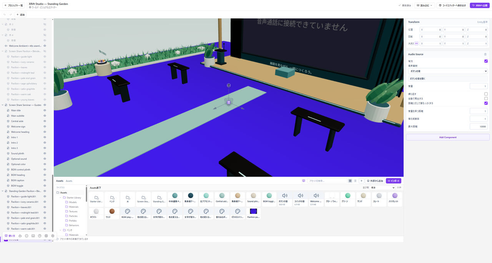

# BGMや環境音を鳴らす

音声ファイルを取り込み、シーンの音源から鳴らします。**BGMのように広く聞かせる音**と、**近づいたときに聞こえる環境音**を分けて考えます。

*音源のEntityを選ぶと使う音声・音量・繰り返しを確認できます。*

## まず動く見本で試す

**Assets → 外部から追加 → 3Dセット → 環境音のスピーカー**を追加します。ループする音源が設定されているため、Playで近づいたり離れたりして確認できます。

設定場所を覚えてから、自分の音声へ差し替えてください。

## 自分の音声に替える

1. 音声ファイルを**Assets**へ追加します。
2. 音源を持つEntityをHierarchyで選びます。
3. Inspectorの音源設定で、使う音声を選びます。
4. 音量、繰り返し、再生の開始条件を確認します。
5. **Play**で実際に音を聞きます。

音声ファイルがAssetsにあるだけでは鳴りません。音源への割り当てと、再生を始める設定が必要です。

## 聞こえる範囲を確認する

環境音は、音源の近くと遠くで聞き比べます。BGMとして使う場合も、入口だけでなく、ワールドの各所で意図した音量になっているか確認してください。

音量の**Volume**と、マテリアルの厚みを扱う**Volume**は別の設定です。

## ボタンを押したときだけ鳴らす

**3Dセット → 音の出るボタン**を使うと、操作と音の関係を確認できます。自分で組み立てる場合は、[ノードの仕掛け](./interactivity.md)で、操作をきっかけに音源を再生します。

## 音が鳴らない

音声の読み込みエラー、音源への割り当て、音量、再生の開始条件を順に確認します。プレイヤーが聞こえる範囲の外にいないか、端末やブラウザがミュートになっていないかも確認してください。

公開する音源は、使用と配布が許可されたものを使います。
