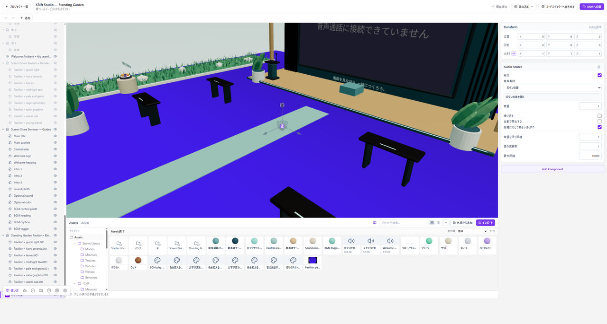

# BGMや環境音を鳴らす

音声ファイルを取り込み、シーンの音源に割り当てると音を鳴らせます。BGMを広く聞かせるか、近づいたときだけ聞こえる環境音にするかに合わせて設定してください。

*音源のEntityを選ぶと、音声、音量、繰り返しの設定を確認できます。*

## まず動く見本で試す

「Assets → 外部から追加 → 3Dセット → 環境音のスピーカー」を追加してください。繰り返し再生する音源が設定されています。Playで近づいたり離れたりして、聞こえ方を確かめられます。

設定欄を確認できたら、自分の音声に差し替えてみてください。

## 自分の音声に替える

音声ファイルをAssetsに取り込み、Hierarchyで音源のEntityを選んでください。Inspectorの音源設定で使う音声を指定します。音量、繰り返し、再生の開始条件を設定したら、Playで聞いてみてください。

Assetsに音声を取り込むだけでは再生されません。音源への割り当てと、再生を始める設定が必要です。

## 聞こえる範囲を確認する

Audio Sourceの「グローバル」をオンにすると、音源との距離や向きに関係なく一定の音量で再生されます。BGMにはこの設定を使い、必要に応じて「繰り返す」と「自動で再生する」もオンにしてください。

「グローバル」をオフにすると、音源の方向と距離によって聞こえ方が変わります。「音量が下がり始める距離」を超えると、離れるほど音量が下がります。「音量の下がり方」が0なら、距離による音量の変化はありません。値を大きくすると、距離に応じて音量が下がりやすくなります。

環境音は近くと遠くで聞き比べてください。BGMもワールドの各所を歩き、意図した音量で聞こえるか確認します。

音源の「音量」と、マテリアルの厚みを扱うVolumeは別の設定です。

## ボタンを押したときだけ鳴らす

「3Dセット → 音の出るボタン」を追加すると、ボタン操作で音が鳴る見本を試せます。自分で作る場合は、[Node Graph](./interactivity.md)でボタン操作をきっかけに音源を再生してください。

## 音が鳴らない

音声の読み込みエラー、音源への割り当て、音量、再生の開始条件を順に確認してください。プレイヤーが聞こえる範囲にいるか、端末やブラウザがミュートになっていないかも確かめます。

公開する音声には、使用と配布が許可されたものを選んでください。
