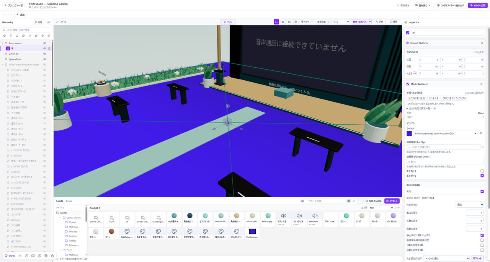

# 歩ける床と開始位置を作る

プレイヤーが床に立つには、床のColliderによる衝突判定が必要です。床が見えるのに落ちる場合は、Colliderとプレイヤーの開始位置を確認してください。

*Hierarchyで床を選び、Box Colliderが有効で、Rigid Bodyが固定になっていることを確認してください。*

## 床のColliderを確認する

Stopで編集へ戻り、Hierarchyで床のEntityを選んでください。InspectorでColliderが追加され、有効になっていることを確認します。Colliderの形や大きさが、歩く場所に合っているかも確かめてください。

新しく追加するPlaneにはBox Colliderが付いています。初期の厚みは0.02 mです。TransformのScale Zを変えると厚みも変わります。平面の広さはScale XとYで調整してください。Mesh Colliderへ変える必要はありません。

Colliderがない場合は、Add ComponentからBox ColliderやMesh Colliderなど、対象に合うものを追加してください。床や壁など動かさないEntityでは、Rigid Bodyをfixedに設定します。薄い床や複雑なモデルでは、見た目の形とColliderの形が異なる場合があります。

## 開始位置を確認する

HierarchyでSpawnPointなど開始位置のEntityを選び、歩ける床の上へ移動してください。床や壁の中、ワールドの外になっていないか確認します。

「空のワールド」には、PlaneとSpawnPointが配置されています。最初の練習では、この二つを残して進めてください。

## Playで確認する

Playを押し、読み込みが終わったら歩いてください。床の中心に加え、端や段差の近くも確認します。落下して開始位置に戻る動作が続く場合は、Colliderと開始位置を見直してください。

## 押せるボタンとの違い

ボタンなどを押すには、Interactableの設定が必要です。プレイヤーがぶつかるColliderとは役割が異なります。押せない場合は、[仕掛けの設定](./interactivity.md)を確認してください。

## Mesh Colliderへ切り替える

Mesh RendererのCollision欄には、現在のBox ColliderやMesh Colliderを表示します。「固定Mesh Colliderにする」は、既存のColliderを無効にし、固定・Trimesh・TriggerなしのMesh Colliderへ切り替える操作です。Box Colliderのサイズを調整したいだけなら、下のBox Colliderで編集してください。

「これだけにする」はシーン全体のほかのColliderと自動生成を無効にします。床やTriggerにも影響するため、対象を確認してから使ってください。変更は「元に戻す」で戻せます。

## 見た目を変えたらColliderも確認する

モデルの差し替え、大きさの変更、親子関係の変更後は、Playで再度歩いてください。見た目を確認するだけでは、通れない通路やすり抜ける床を見落とすことがあります。
