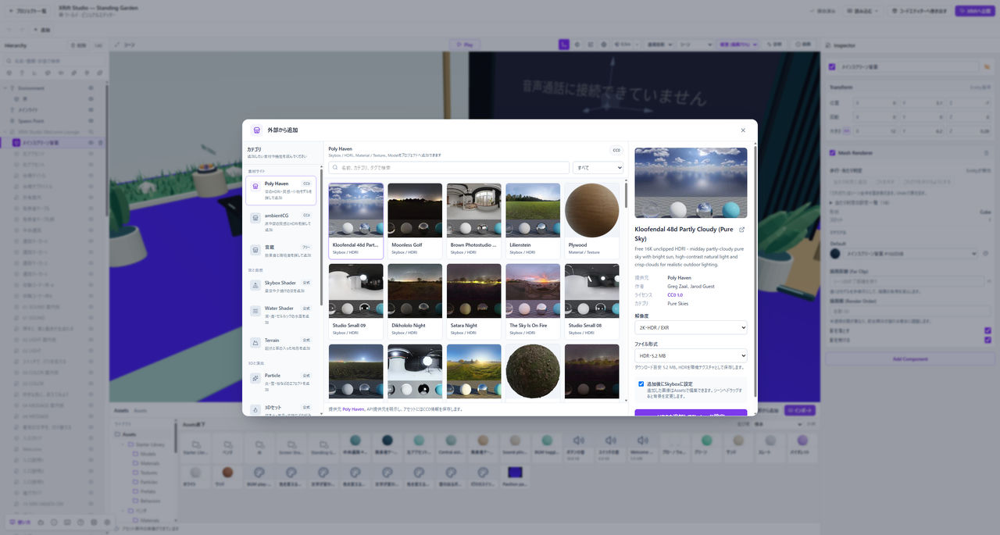

# カタログから素材を追加する

素材を探して取り込む入口は、**Assets → 外部から追加**です。使いたい見た目や機能から選びます。

*外部から追加では詳細の見本と追加内容を確認してから取り込みます。*

## 選んで追加する

1. **外部から追加**を押します。
2. 左の一覧で、モデルや質感なら**Poly Haven**、空なら**Skybox Shader**などを選びます。
3. 名前や説明で検索し、詳細の見本と追加する内容を確認します。
4. 解像度や形式を選ぶ項目がある場合は、容量も確認してから追加します。

取り込みが終わったら、Assetsまたはシーンに増えたものを確認します。ダウンロードに失敗した場合は、完了したものとして作業を続けず、表示されたエラーを確認してください。

## 追加後に何が起きる？

**モデル：** Assetsに取り込み、シーンへ配置して使います。

**マテリアル：** 物の表面へ割り当てます。追加するだけでシーンの全体に適用されるものではありません。

**Skybox Shader：** 追加時の設定に応じて背景へ割り当てます。

**Water Shader：** 水面用のマテリアルです。水面にするメッシュへ割り当てて使います。

**3Dセット・Terrain：** 配置されるEntityの構成を詳細で確認します。自分の作品に不要なものまで一緒に置く必要はありません。

## 動く見本から仕組みを覚える

**ギミック**はワールド専用です。音の出るボタン、灯りのスイッチ、自動で閉まる扉などの見本があります。まず詳細の説明を読んで配置し、**Play**で動きを確かめます。アイテムには追加できないため、プロジェクト一覧からワールドを開いて利用してください。

配置したものは通常のEntityや素材として編集できます。[仕掛けの入門](./interactivity.md)では、音の出るボタンから始めます。

## 権利表記を確認する

素材ごとの配布元、作者、ライセンスを詳細で確認してください。必要な権利表記は、ほかの場所へ書き出す場合も取り除かないでください。

すべての外部素材が同じ条件で使えるわけではありません。カタログにあることだけを理由に、用途や再配布条件を判断しないでください。

**マテリアル表現**では、発光する **Emissive** と、Clearcoat・Transmissionなどの **glTFマテリアル** の見本を選べます。家具や装飾は **3Dセット**、Portal・Mirrorなどは **XRift公式コンポーネント** から追加します。
