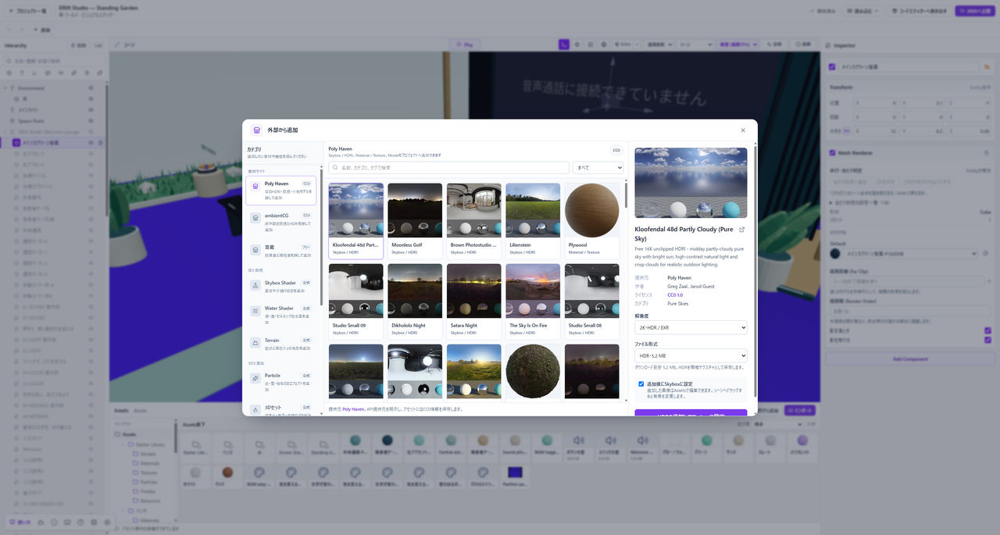

# カタログから素材を追加する

上部の「素材を追加 → 外部から追加」で、素材のカタログを開けます。「Assets → 外部から追加」からも同じカタログを使えます。見た目や機能を確認して、作品に合う素材を選んでください。

*素材の詳細で、見本と追加される内容を確認できます。*

## 選んで追加する

「外部から追加」を開き、左の一覧で配布元や素材の種類を選んでください。モデルや質感はPoly Haven、空はSkybox Shaderなどから探せます。名前や説明で検索し、詳細画面で見本と追加内容を確認します。解像度や形式を選べる場合は、容量も確認してから追加してください。

取り込みが終わったら、Assetsやシーンに追加された内容を確認します。ダウンロードに失敗した場合は、表示されたエラーを確認してください。

ブラウザ版では、音蔵の効果音や環境音を直接追加できます。音蔵で音源を検索し、詳細の「プロジェクトに追加」を押すと、OGG音源がAssetsに保存されます。追加した音源はAudio Sourceに設定してください。Poly HavenとambientCGからの直接追加は、デスクトップ版で使えます。

## 追加後に何が起きる？

| 素材 | 使い方 |
| --- | --- |
| モデル | Assetsに取り込んでから、シーンへ配置します。 |
| マテリアル | 使いたいEntityの表面に割り当てます。シーン全体に自動では適用されません。 |
| Skybox Shader | 追加時の設定に応じて、背景に割り当てられます。 |
| Water Shader | 水面にするメッシュへ割り当てるマテリアルです。 |
| 3Dセット・Terrain | 詳細でEntityの構成を確認し、必要なものを配置します。 |

## 動く見本から仕組みを覚える

ギミックは、ワールドとアイテムの両方に追加できます。音の出るボタン、灯りのスイッチ、自動で閉まる扉などの見本があります。詳細の説明を読んで配置し、Playで動作を確かめてください。プレイヤーやルームが必要な動作は、アイテムの配置先ワールドでも確認します。

追加したギミックは、通常のEntityや素材として編集できます。[仕掛けの入門](./interactivity.md)では、音の出るボタンの作り方を説明します。

## 権利表記を確認する

素材の詳細で、配布元、作者、ライセンスを確認してください。ほかの場所へ書き出す場合も、必要な権利表記を残します。

素材の使用条件は配布元ごとに異なります。用途や再配布の条件は、カタログへの掲載だけでは判断できません。

「マテリアル表現」では、Emissiveの発光や、Clearcoat、TransmissionなどのglTFマテリアルを試せます。家具や装飾は「3Dセット」、PortalやMirrorなどは「XRift公式コンポーネント」から追加してください。
