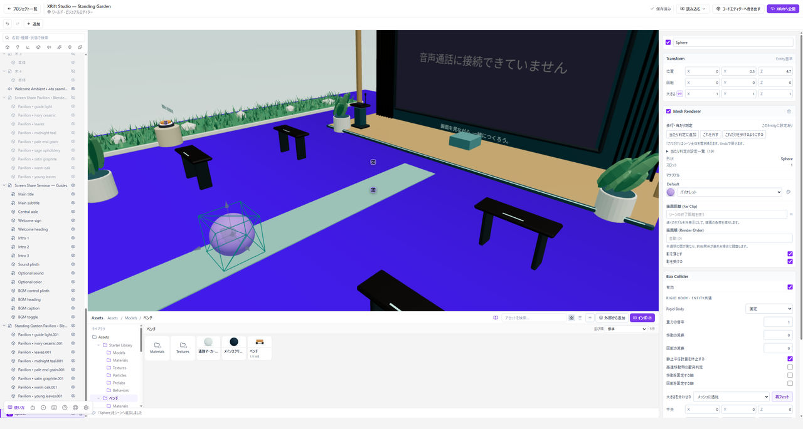

# 最初のワールドを作る

床の上に色のついた球を置き、保存して、Playで見て回ります。操作の練習なので、外部素材のダウンロードやAI接続は使いません。

**始める前に：** [アプリを起動](./installation.md)してください。すでに作品を編集中なら、先に保存してから新しいプロジェクトで試します。

*追加 → Primitive → Sphereで球を置くと、Hierarchyに項目が増え、中央のシーンに現れます。*

## 1. 空のワールドを開く

プロジェクト一覧では**新規プロジェクト**を押し、ワールドの**ビジュアルエディター**を選びます。テンプレートを選べる場合は**空のワールド**を選んでください。床・ライト・開始位置が入った状態で始まります。

プロジェクト名には、たとえば`my-first-world`と入力します。フォルダー名に使うため、半角の英小文字・数字・ハイフンを使い、先頭は英小文字か数字にしてください。作品の日本語タイトルはあとから設定できます。

セットアップ画面の**ワールドを作る**からすでに編集画面に入っている場合は、そのワールドで続けて構いません。床や開始位置は消さずに残してください。

## 2. 球を置く

画面上部の**追加 → Primitive → Sphere**を選びます。左の**Hierarchy**に項目が増え、中央のシーンに球が現れます。

球を選び、右の**Inspector → Transform**で位置を調整します。練習用の値は、位置を**X: 0 / Y: 1 / Z: 0**、大きさを**X: 1 / Y: 1 / Z: 1**です。床と重なる場合はYを少し上げてください。

球が見つからない場合は、Hierarchyで球を選び、**F**で選択したものへ視点を合わせます。視点の移動は物の移動とは別の操作です。

## 3. マテリアルを作る

下の**Assets**で追加メニューを開くか、空いている場所を右クリックし、**新規マテリアル**を選びます。作ったマテリアルを選ぶと、Inspectorに色や質感の設定が表示されます。

**Base Color**で好きな色を選び、**Metallic**を**0**、**Roughness**を**0.5**にします。これは金属ではない、ほどよく反射がぼける表面の出発点です。

マテリアルを作っただけでは、まだ球に適用されていません。

## 4. 球に色を付ける

Hierarchyで球を選びます。**Inspector → Mesh Renderer → マテリアル**の欄から、作ったマテリアルを選びます。Assetsからその欄へドラッグして割り当てることもできます。

球の色が変われば成功です。Assetsでマテリアルを選び直してRoughnessを動かすと、同じ球の反射の見え方が変わります。[マテリアルの基本](./materials.md)で、数値の意味を詳しく確認できます。

## 5. 保存する

**Ctrl + S**（Macは**⌘ + S**）で保存します。保存先や名前を求められたら入力し、画面の保存状態を確認してください。保存できたことを確認してから次へ進みます。

自動保存だけを頼りに終了せず、特に最初の保存と保存エラーの有無を確認します。保存先が分からなくなった場合は[保存と制作の再開](./save-and-open.md)を参照してください。

## 6. Playで見て回る

**Play**を押し、読み込みが終わったら中央の画面をクリックします。**WASD**または矢印キーで歩き、球を別の角度から見てみましょう。

編集へ戻るときは**Esc**でマウス固定を解除し、**Stop**を押します。Play中に色の設定が変更できなくても故障ではありません。マテリアルの編集はStop後に行います。

**ここまでの確認：** 球が置けた、色が変わった、保存できた、Playから編集に戻れた。この四つができれば最初の操作は完了です。

## 次は何をする？

球を自分のモデルに替えるなら[モデルや画像を取り込む](./assets.md)、表面をもっと作り込むなら[色と質感を変える](./materials.md)へ進みます。公開は作品が整ってからで構いません。
