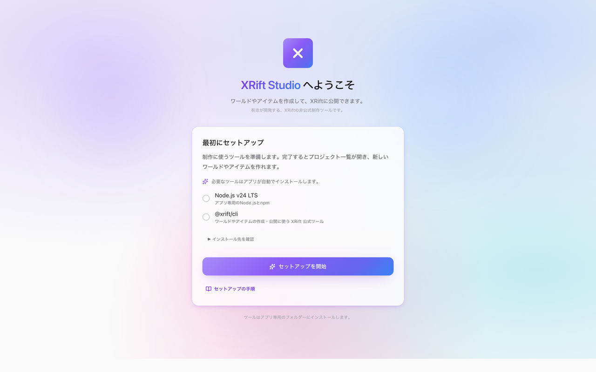
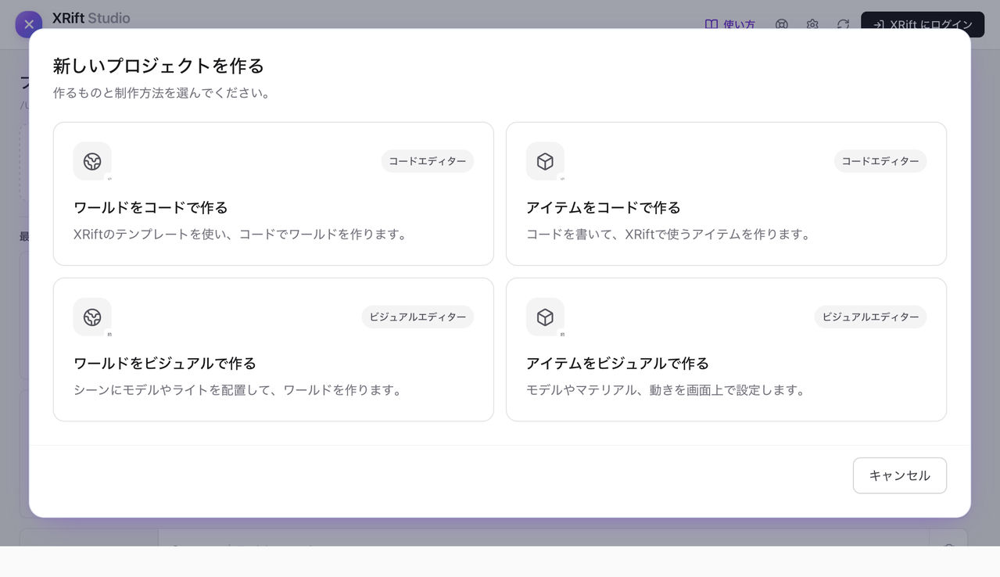
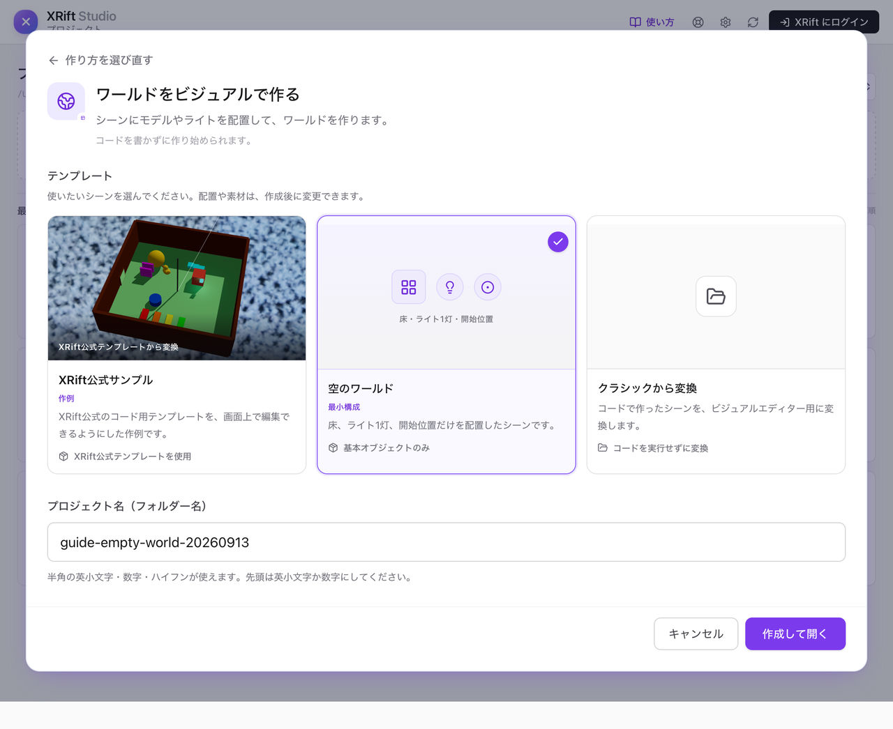
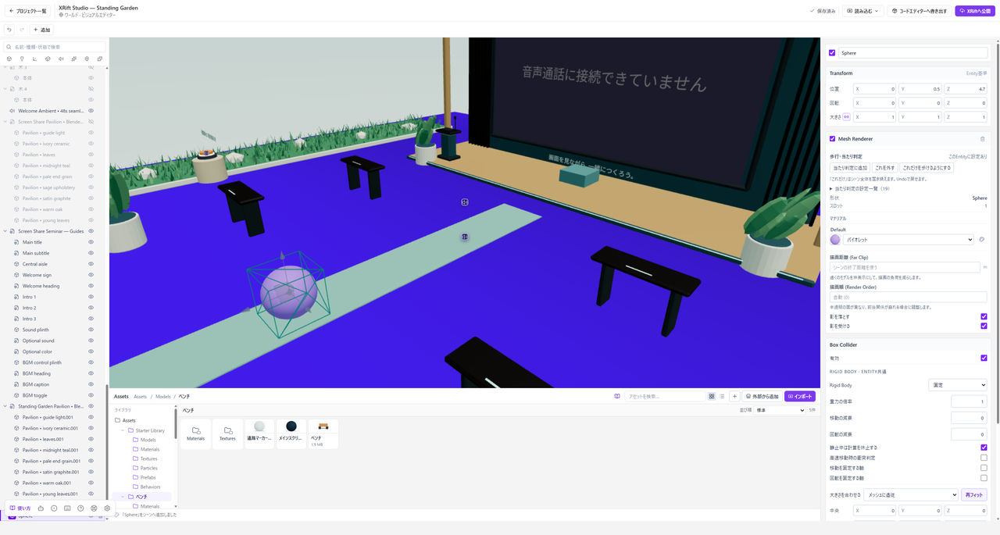
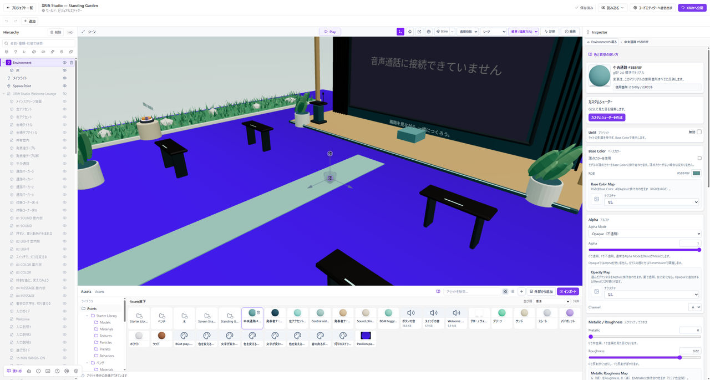
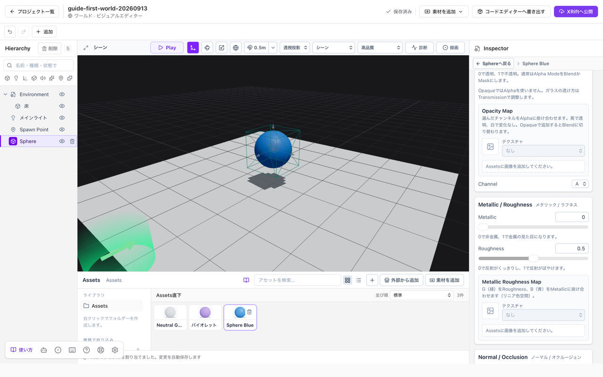
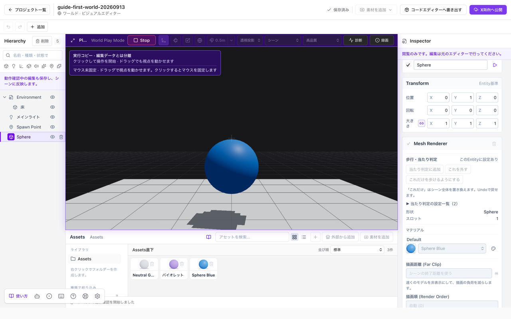

# 最初のワールドを作る

床の上に球を置いて色を変え、保存できたらPlayで見て回ります。この練習に、外部素材のダウンロードやAI接続は必要ありません。

[インストールとセットアップ](./installation.md)を済ませてから始めてください。別の作品を編集中の場合は「保存済み」を確認し、新しいプロジェクトで試してください。

*この画面では「セットアップを開始」を押してください。完了してプロジェクト一覧が開いたら、次の手順へ進めます。*

## 1. 空のワールドを開く

プロジェクト一覧で「新規プロジェクト」を押し、「ワールドをビジュアルで作る」を選んでください。

*左下のカードから、ワールドのビジュアルエディターへ進みます。*

テンプレートには「空のワールド」が選ばれています。床、ライト、開始位置があらかじめ配置されます。

プロジェクト名には、たとえば`my-first-world`と入力してください。フォルダー名にも使うため、半角の英小文字、数字、ハイフンが使えます。先頭は英小文字か数字にしてください。作品の日本語タイトルはあとから設定できます。

*図では撮影用の名前を入力しています。名前を決めたら「作成して開く」を押します。*

床や開始位置は消さずに残してください。

## 2. 球を置く

上部の「素材を追加 → Entityを作成 → Primitive → Sphere」を選んでください。HierarchyにSphereが追加され、中央のシーンに球が表示されます。

球を選び、右の「Inspector → Transform」で位置をX: 0 / Y: 1 / Z: 0、大きさをX: 1 / Y: 1 / Z: 1にしてください。床と重なる場合は、Yの値を少し上げます。

球が見つからない場合は、HierarchyでSphereを選んでFを押してください。球に視点が合います。視点を動かしても、球の位置は変わりません。

*HierarchyでSphereを選ぶと、右のTransformに位置と大きさが表示されます。*

## 3. マテリアルを作る

下のAssetsで追加メニューを開くか、空いている場所を右クリックして「新規マテリアル」を選んでください。作ったマテリアルを選択すると、Inspectorに色や質感の設定が表示されます。

Base Colorで好きな色を選び、Metallicを0、Roughnessを0.5にしてください。非金属の表面になり、反射がほどよくぼけます。

次の手順で、このマテリアルを球に割り当てます。

*例ではSphere Blueという名前のマテリアルを作り、Base Colorを青色にしています。*

*Inspectorを下へスクロールすると、MetallicとRoughnessがあります。*

## 4. 球に色を付ける

Hierarchyで球を選び、「Inspector → Mesh Renderer → マテリアル」の欄で作ったマテリアルを指定してください。Assetsからこの欄へドラッグしても割り当てられます。

球の色が変われば、割り当ては完了です。Assetsでマテリアルを選び直し、Roughnessを変えると反射のぼけ方も変わります。数値の意味は、[マテリアルの基本](./materials.md)で詳しく説明します。

*球が青くなり、Mesh Rendererのマテリアル欄にもSphere Blueが表示されています。図では見やすいようAmbient Lightを有効にしています。*

*マテリアルはこの欄に割り当てます。*

## 5. 自動保存を確認する

編集した内容は自動保存されます。保存ボタンやショートカットを毎回押す必要はありません。

画面上部のプロジェクト名の近くで、表示が「保存待ち → 保存中 → 保存済み」と変わることを確認してください。「保存済み」なら、変更は保存されています。

「保存エラー」が出たときは、編集画面を閉じずにエラーの内容を確認してください。保存先や作品を開き直す方法は、[保存と制作の再開](./save-and-open.md)を参照してください。

## 6. Playで見て回る

Playを押し、読み込みが終わったら中央の画面をクリックしてください。WASDまたは矢印キーで歩き、球を別の角度から見てみましょう。

編集へ戻るときは、Escでマウス固定を解除してStopを押してください。マテリアルはPlay中に編集できないため、色を変えたいときもStopで戻ります。

*中央のPlay Windowをクリックして操作を始めます。編集へ戻るボタンは上部のStopです。*

球の配置、色の変更、保存、Playから編集へ戻る操作を確認できれば、この練習は完了です。

## 次は何をする？

自分のモデルを置くには[モデルや画像を取り込む](./assets.md)、表面を詳しく調整するには[色と質感を変える](./materials.md)を参照してください。公開の操作は、作品ができてから試せます。
