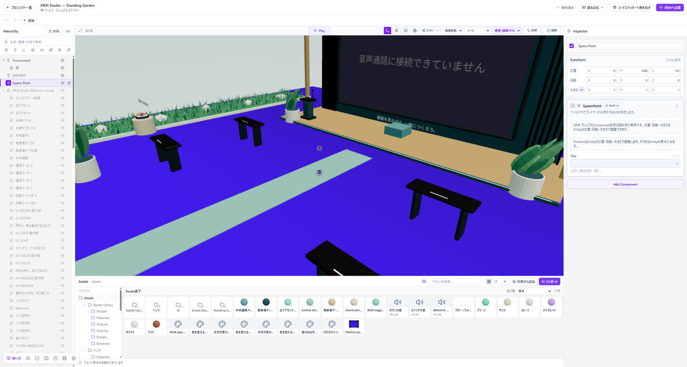

# 画面に出てくる用語

画面の項目名と、その意味をまとめています。分からない名前が出てきたときに確認してください。

*画面に表示される名前で検索できます。各パネルの位置は画像で確認してください。*

## Entity

床、モデル、ライトなど、シーンに配置する一つひとつをEntityと呼びます。操作は[配置の手順](./objects.md)を参照してください。

## Hierarchy

配置したEntityの一覧と親子関係を表示するパネルです。[画面の見方](./editor-basics.md)で使い方を説明します。

## Inspector

選んだEntityや素材の設定を編集するパネルです。選択したものによって、表示される設定が変わります。

## Assets

モデル、画像、音声、マテリアルなどを管理するパネルです。取り込んだモデルは、シーンへドラッグすると配置できます。

## Component・Components

Entityに追加する機能をComponentと呼びます。音源、ライト、Colliderなどがあり、Add Componentから選んで追加できます。

## マテリアル・テクスチャ

マテリアルは表面の色や反射を決める素材です。テクスチャは色や凹凸などを表す画像です。詳しくは[マテリアル](./materials.md)と[テクスチャ](./textures.md)を参照してください。

## Base Color・Metallic・Roughness

Base Colorは色、Metallicは金属度、Roughnessは反射のぼけ方を調整する設定です。[三つの基本設定](./materials.md)で、値による違いを説明します。

## Normal Map

陰影で細かな凹凸を表す画像です。形状の輪郭やColliderは変わりません。使い方は[テクスチャの説明](./textures.md#normal-mapで細かな凹凸を表す)を参照してください。

## Skybox・IBL

Skyboxは背景の表示に使います。IBLは環境画像を照明や反射に使う設定です。[空と照明の違い](./sky-and-water.md#背景と照明を分けて設定する)で説明します。

## Emissive・Bloom

Emissiveは表面自体の明るさ、Bloomは明るい部分をにじませる画面効果です。周囲を照らすには別途ライトが必要です。詳しくは[光の設定](./lighting.md#emissiveとbloomの違い)を参照してください。

## Collider・Spawn Point

Colliderは衝突や接触を検知する形状です。Spawn Pointはプレイヤーの開始位置です。[歩ける床](./collision.md)の作り方で、設定を説明します。

## プレハブ・ノードグラフ

プレハブは、Entityの組み合わせを再利用するための素材です。Node Graphでは、処理を線でつないで動作を組み立てます。[プレハブ](./prefabs.md)と[仕掛け](./interactivity.md)を参照してください。

## Play・Stop

Playで動作確認を始め、Stopで編集へ戻れます。操作は[Playの使い方](./play-mode.md)を参照してください。
