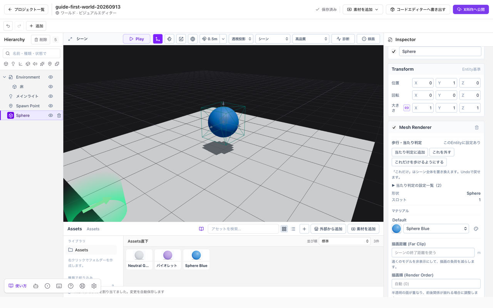

# XRift Studio 使い方ガイド

XRift Studioは、画面に素材を配置してワールドやアイテムを作るアプリです。このガイドでは、コードを書かずに使うビジュアルエディターから始めます。

*左のHierarchyで球を選び、右のInspectorで調整します。下のAssetsには球に使うマテリアルがあります。*

## はじめて使う

まだアプリがない方は、[インストール](./installation.md)から始めてください。アプリを開ける方は、[最初のワールドを作る](./first-world.md)へ進みます。

インストールせずに始める場合は、[ブラウザのビジュアルエディター](https://webxr-jp.github.io/xrift-studio/editor.html)を開きます。iPadの操作は、[iPadで作り、パソコンへ引き継ぐ](./ipad.md)をご覧ください。ブラウザで編集し、`.xriftstudio`ファイルをMacまたはWindowsへ渡して公開する流れです。

デスクトップ版は、初回セットアップを済ませてから制作を始めます。XRiftへのログインやAI接続はあとから行えます。まずは「配置する・色を変える・自動保存を確認する・Playで確かめる」を一度体験しましょう。

## 操作を調べる

画面の名前が分からないときは[画面の見方](./editor-basics.md)、英語の項目の意味は[用語集](./glossary.md)を参照してください。検索では、画面の項目名でも「床をすり抜ける」のような困りごとでも探せます。

## このガイドの対象

基本の制作手順はデスクトップ版を対象にしています。iPadの画面・タッチ操作・保存方法は[iPadの案内](./ipad.md)で補います。スマートフォンでも、パネルを切り替えて配置や質感を編集できます。ブラウザへの保存、プロジェクトの書き出し、XRiftへの公開は別の操作です。

アプリそのものを改造するためのビルド、デプロイ、APIの説明は、GitHubの開発文書に分けています。
