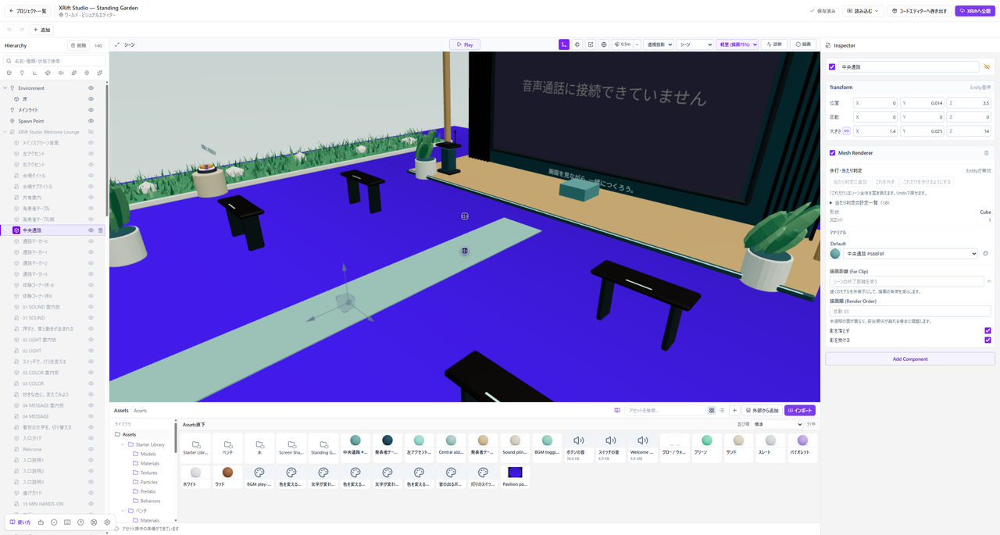

# XRift Studio 使い方ガイド

XRift Studioでは、3Dモデルなどの素材を画面に配置してワールドやアイテムを作れます。このガイドでは、コードを書かずに制作できるビジュアルエディターの使い方を説明します。

*左のHierarchyで球を選び、右のInspectorで調整します。下のAssetsには球に使うマテリアルがあります。*

## はじめて使う

まだアプリを入れていない方は、[インストール](./installation.md)から始めてください。起動できたら、[最初のワールドを作る](./first-world.md)へ進んでください。

インストールせずに使う場合は、[ブラウザのビジュアルエディター](https://webxr-jp.github.io/xrift-studio/editor.html)を開いてください。iPadでの操作は、[iPadで作り、パソコンへ引き継ぐ](./ipad.md)で説明します。ブラウザ版βからのワールド公開と、`.xriftstudio`ファイルをMacやWindowsへ渡して公開する方法は、[公開の手順](./publishing.md)を参照してください。

デスクトップ版では、初回セットアップを済ませると制作を始められます。XRiftへのログインとAI接続はあとから設定できます。まずは素材を置き、色を変え、自動保存を確認してからPlayで見て回ってください。

## 操作を調べる

各パネルの使い方は[画面の見方](./editor-basics.md)、英語の項目名の意味は[用語集](./glossary.md)で確認できます。検索には、画面の項目名や「床をすり抜ける」のような症状を入力してください。

## このガイドの対象

基本の制作手順はデスクトップ版を対象にしています。iPadでのタッチ操作や保存方法は、[iPadの案内](./ipad.md)を参照してください。スマートフォンでも、パネルを切り替えながら配置や質感を編集できます。ブラウザに保存した作品をファイルとして手元に残すには書き出し、XRiftで遊べるようにするには公開の操作が必要です。

アプリの開発に必要なビルド、デプロイ、APIの説明は、GitHubの開発文書にあります。

## 作ったものを別のプロジェクトでも使う

家具やギミックなど、Hierarchyで選んだ部分を`.xriftstudio`ファイルに書き出せます。別の作品へ取り込む手順は、[Entityを別のワールド・アイテムへ渡す](./hierarchy-transfer.md)を参照してください。

## MToon・GLSL・録画を使う

- [MToonの陰影と輪郭線](./materials.md#mtoonマンガのような陰影と輪郭線を付ける)
- [GLSLでマテリアルを編集する](./custom-shaders.md)
- [ワールドを動画に録画する](./recording.md)

このガイドはv1.0.1のソースを基準に、2026年9月30日に更新しています。画像は過去の画面を含むため、操作名や対応範囲は本文で確認してください。
