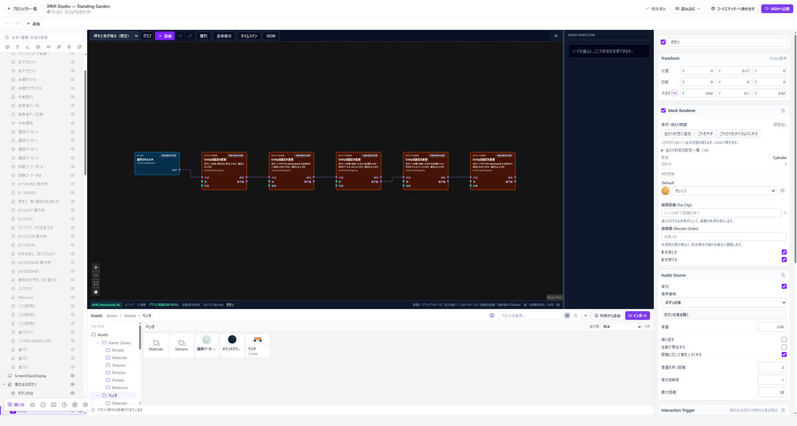

# ボタンで動く仕掛けを作る

**ノードグラフ**は、「押されたら音を鳴らす」のような処理を線でつなぐ仕組みです。まず動く見本を置き、何が付いているか確かめましょう。

*グラフではきっかけから処理への線を確認します。最初は一つの値だけ変えて試します。*

## 1. 音の出るボタンを置く

**Assets → 外部から追加 → 3Dセット → 音の出るボタン**を選び、詳細の説明を読んで追加します。

カタログを閉じて**Play**を押し、ボタンに近づいてクリックします。音が鳴れば、動く見本を確認できました。

## 2. ボタンの構成を見る

**Stop**して、HierarchyでボタンのEntityを選びます。Inspectorで、**操作を受け付ける**、**音源**、**グラフの実行**を確認します。

形がボタンに見えることと、押して反応することは別です。押される入口、動かす処理、鳴らす音をそれぞれ設定しています。

## 3. グラフを開く

Assetsでボタンに割り当てられたノードグラフを開き、きっかけから処理へつながる線を確認します。ノードを選ぶと**Node Inspector**で対象や値を調整できます。

最初は音量など一つの値だけを変え、Playで違いを確認してください。仕組みが分かってから、自分のモデルや音へ差し替えます。

## 自分でグラフを作る

1. Assetsの追加メニューから、新しい**ノードグラフ**を作ります。
2. グラフを付けるEntityをHierarchyで選びます。
3. ノードエディター上部の案内から、選んだEntityにグラフを付けます。
4. プレイヤーが押す仕掛けでは、同じEntityに**操作を受け付ける（Interactable）**も追加します。

**グラフを素材として作っただけでは動きません。** 「開始時に実行」から始まるものも、Entityへ付ける必要があります。

## きっかけと処理をつなぐ

**操作されたとき**は押されたとき、**開始時に実行**はワールドの開始時に動く入口です。続く処理へ線をつなぎます。処理の接続は紫、値の接続は水色です。

待機やアニメーションの終了後に進めたい場合は、**完了後**から次へつなぎます。**出力**は処理を始めた直後に進むため、完了を待つ意味にはなりません。

**順に実行**も、接続先を順番に開始するだけで、各処理の完了を待ちません。時間のある処理は完了後の接続を確認してください。

## 自分だけ・みんなでの違い

シーンの見た目やプレイヤーの移動は、操作した人の端末だけに反映されます。ほかの人の画面や位置まで変わるわけではありません。

対応する扉や色などの状態を共有する場合は、対象の設定で**みんなに見せる**を有効にします。一人のPlayだけでは同期を確認できないため、公開先でも複数人で確認してください。

## 動かないとき

グラフがEntityに付いているか、操作を受け付ける設定があるか、必要な音源やモデルがあるかを確認します。グラフの**問題の一覧**と保存状態も確認してください。

**実行未対応**のノードは保存できても動きません。エラーがある間は保存が止まる場合があるため、表示を確認してから閉じてください。
