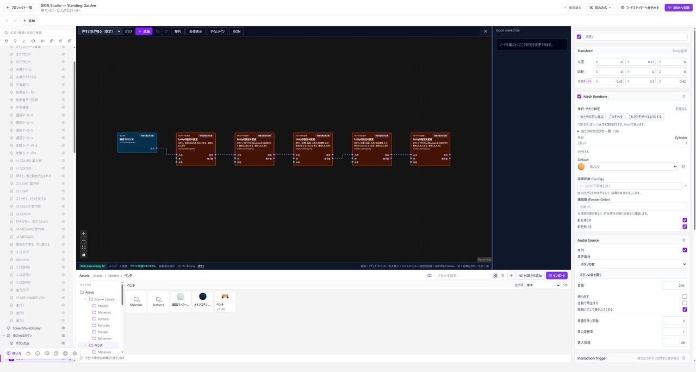

# ボタンで動く仕掛けを作る

動画で操作を確認する：[ノードをつないで箱を動かす](./lesson-03-00.md) / [押すと動くボタンを作る](./lesson-03-01.md) / [Delayで待ってから動かす](./lesson-03-02.md) / [テンプレートでBoxを回転させる](./lesson-03-04.md)

Node Graphでは、きっかけと処理を線でつないで動作を作れます。まず、押すと音が鳴る見本を配置して、構成と設定を確認してください。

*きっかけから処理につながる線を確認できます。最初は一つの値だけを変えて試してください。*

## 1. 音の出るボタンを置く

「Assets → 外部から追加 → 3Dセット → 音の出るボタン」を選び、詳細を読んで追加してください。

カタログを閉じてPlayを押し、ボタンに近づいてクリックします。音が鳴ることを確認してください。

## 2. ボタンの構成を見る

Stopで編集に戻り、HierarchyでボタンのEntityを選んでください。InspectorにはInteractable、Audio Source、Interaction Triggerが設定されています。

ボタンのモデルに加えて、操作を受け付ける機能、実行する処理、再生する音の設定が必要です。

## 3. グラフを開く

Assetsでボタンに割り当てられたNode Graphを開き、きっかけから処理につながる線を確認してください。ノードを選ぶと、Node Inspectorで対象や値を調整できます。

最初は音量など一つの値だけを変え、Playで違いを確かめてください。構成が分かったら、自分のモデルや音に差し替えてみましょう。

## 自分でグラフを作る

Assetsの追加メニューで、新しいNode Graphを作ってください。Hierarchyで取り付けたいEntityを選び、グラフの編集画面上部の案内から取り付けます。プレイヤーが押す仕掛けには、同じEntityにInteractableも追加してください。

グラフは、Entityに取り付けると実行できます。On Startから始まるグラフも、Entityへの取り付けが必要です。

## きっかけと処理をつなぐ

On Interactは、押されたときに処理を始めます。On Startは、ワールドの開始時に処理を始めます。各ノードから、実行したい処理へ線をつないでください。処理の線は紫、値の線は水色です。

待機やアニメーションが終わってから次に進めるには、Doneからつないでください。Outは処理を始めた直後に進むため、終了を待ちません。

Sequenceも、接続先の処理を順番に開始するだけです。時間がかかる処理の終了を待つには、Doneから次の処理へつないでください。

## 自分だけ・みんなでの違い

シーンの見た目やプレイヤーの移動を変える操作は、操作した人の端末だけに反映されます。ほかの人の画面や位置は変わりません。

対応する扉や色などの状態を共有するには、対象の設定で「同じ部屋の全員に反映する」を有効にしてください。同期は一人のPlayでは確認できないため、公開先で複数人で試してください。

## 動かないとき

グラフがEntityに付いているか、Interactableがあるか、必要な音源やモデルがあるかを確認してください。グラフの「問題の一覧」と保存状態も確かめます。

「実行未対応」のノードは、保存できても動作しません。エラーがあると保存が止まる場合もあります。状態の表示を確認してから閉じてください。
