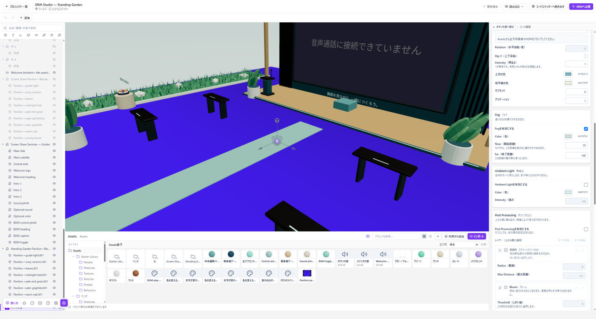

# ライトと画面の明るさを調整する

物を照らす設定と、画面全体の見え方を変える設定を分けて調整します。Play中なら**Stop**で編集に戻ってください。

*全体の明るさはシーン設定で調整します。ライトの追加と分けて確認します。*

## ライトで物を照らす

**追加**からライトを置き、Entityを選んでInspectorで位置、色、強さを調整します。すでにライトがある場合は、Hierarchyで選んで変更してください。

まず一つのライトで、どこが照らされるかを確認します。暗いからといってライトを次々に増やす前に、位置や向きも見直してください。

## 全体の明るさを調整する

エディター左下から**シーン設定**を開きます。

**Ambient Light**は全体を均一に照らす設定、**Exposure**は画面全体の明るさの調整です。背景だけの明るさを変えたい場合とは、触る項目が異なります。

## 金属が暗い・反射が見えない

[マテリアル](./materials.md)のMetallicを1にしたとき、反射する環境がないと、期待した金属の見え方にならないことがあります。

**シーン設定 → Skybox**で**Skybox Texture**にHDRIなどの環境画像を選び、**IBL**を有効にします。IBLは画像を照明や反射に使う設定です。Skybox Shaderの背景だけを追加しても、照明が同時に用意されるわけではありません。

## EmissiveとBloomの違い

**Emissive**はマテリアルの表面を明るくする設定です。**Bloom**は、明るい部分の光を画面上でにじませる効果です。どちらも、ライトのように周囲の物を照らす設定ではありません。

光る看板を作る場合は、マテリアルのEmissiveとEmissive Strengthを調整し、シーン設定の**Post Processing → Bloom**を確認します。周囲も照らしたい場合はライトを用意します。

Bloomの**Threshold**はにじませる明るさの境目、**Strength**は強さ、**Radius**は広がりです。まず小さな変化で比較してください。

## 陰影や色味を整える

**SSAO**は接地部分や隙間に陰影を加えます。**Color Grading**は画面全体の明暗差や色味を調整します。

効果を重ねる前に、元のライトとマテリアルで形が見えているか確認してください。エフェクトを増やすほど描画負荷が増える場合があります。

## 影やBloomが見えない

編集中は、表示モードを**シーン**、描画品質を**高品質**にしてください。軽量な編集表示では、影やPost Processingを省きます。

設定を変えても期待どおりにならない場合は、一度ほかの効果を切り、ライト、Emissive、Bloomを一つずつ確かめてください。
