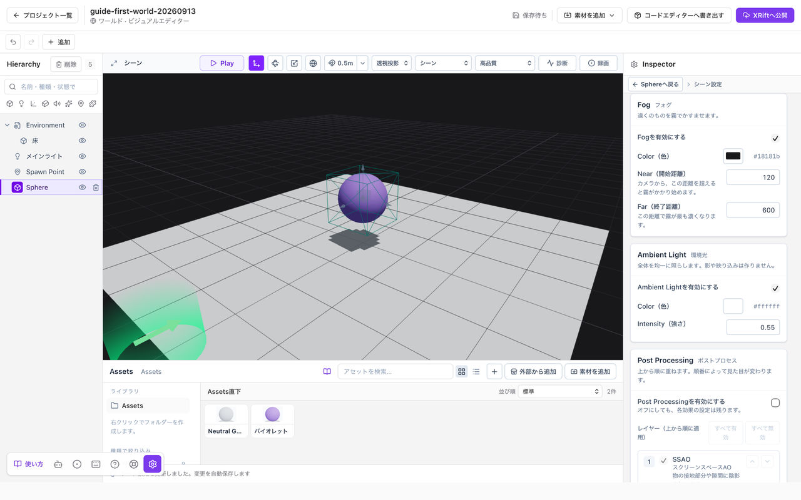

# ライトと画面の明るさを調整する

動画で操作を確認する：[ライトの明るさと影を調整する](./lesson-01-06.md) / [Bloomで光をにじませる](./lesson-04-08.md)

ライトは物を照らし、画面効果は表示全体の見え方を調整します。ライトの設定は、Play中もInspectorで変更して確認できます。

*Ambient Lightを有効にすると、全体が均一に照らされます。画像のIntensityは0.55です。*

## ライトで物を照らす

「追加」からライトを置き、そのEntityを選んでInspectorで位置、色、強さを調整してください。配置済みのライトはHierarchyから選べます。

まず一つのライトで、照らされる範囲を確認してください。暗い場合は、ライトを増やす前に位置や向きを調整します。

Directional LightとSpot Lightの向きは、「照らす方向」で変えられます。Point Light、Spot Light、Rect Area LightではPowerも入力できます。PowerとIntensityは連動します。

## 影を調整する

Directional Light、Point Light、Spot Lightで影を出すには、`castShadow`を有効にしてください。ライトごとに`shadow.intensity`、`shadow.mapSize.x/y`、`shadow.radius`を調整できます。影の解像度の初期値は256 pxです。表面に縞が出る場合や、影が物体から離れる場合は、`shadow.bias`と`shadow.normalBias`を調整してください。

「シーン設定 → Shadow Map」では、シーン全体で使うThree.jsの影アルゴリズムを選べます。初期値の`PCFShadowMap`は、ソフトな影を表示します。各ライトの解像度は256 px、Radiusは2で始まります。`BasicShadowMap`では、Radiusを変えてもぼかせません。現在のThree.jsでは、`PCFSoftShadowMap`は`PCFShadowMap`に変換されます。VSMのぼかし回数は、ライトごとのBlur Samplesで調整してください。

## 全体の明るさを調整する

エディター左下から「シーン設定」を開いてください。Ambient Lightでは全体を均一に照らし、Exposureでは画面全体の明るさを変えられます。背景だけの明るさは、背景の設定で調整します。

## 金属が暗い・反射が見えない

[マテリアル](./materials.md)のMetallicを1にしても、反射する環境がないと金属らしく見えない場合があります。

「シーン設定 → Skybox」でSkybox TextureにHDRIなどの環境画像を選び、IBLを有効にしてください。IBLは、この画像を照明や反射に使います。Skybox Shaderを背景に設定するだけでは、照明は用意されません。

## EmissiveとBloomの違い

Emissiveはマテリアルの表面自体を明るくします。Bloomは、明るい部分の光を画面上でにじませます。周囲の物を照らすには、別途ライトが必要です。

光る看板を作るには、EmissiveとEmissive Strengthを調整し、シーン設定の「Post Processing → Bloom」を確認してください。周囲も照らす場合は、ライトを置きます。

BloomのThresholdは、にじませる明るさの境目です。Strengthで強さ、Radiusで広がりを調整できます。少しずつ値を変えて比べてください。

## 陰影や色味を整える

SSAOは接地部分や隙間に陰影を加えます。Color Gradingは、画面全体の明暗差や色味を変えます。

効果を加える前に、ライトとマテリアルの設定だけで形が見えるか確認してください。エフェクトを増やすと、描画の負荷が増える場合があります。

## 影やBloomが見えない

編集中は、表示モードを「シーン」、描画品質を「高品質」にしてください。軽量表示では、影やPost Processingが省略されます。

期待した見た目にならない場合は、ほかの効果を一度切り、ライト、Emissive、Bloomを一つずつ確認してください。
