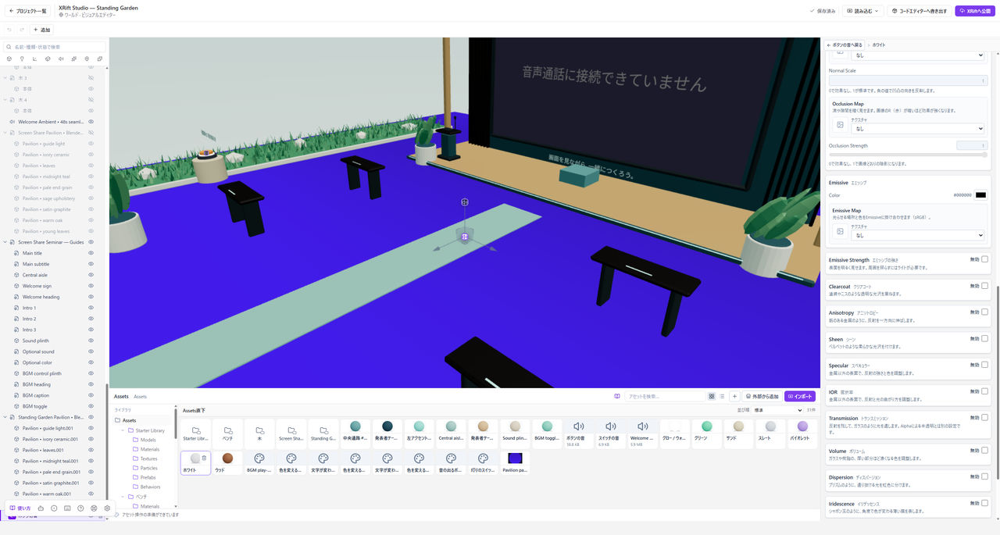

# Clearcoat・Iridescenceなどを使う

[Base Color・Metallic・Roughness](./materials.md)で基本の表面を作ってから、表現に必要な拡張だけを有効にします。項目名はglTFなどと照合できるよう、英語名を使っています。

*基本の表面が整ってから、必要な拡張だけを有効にします。項目名は英語名で確認します。*

## Clearcoat

Clearcoat（クリアコート）は、塗装やニスのような透明な光沢の層を重ねます。下地のRoughnessと、上塗りのRoughnessは別です。

Clearcoat内のNormal Mapも、上塗りの層にだけ使う別の設定です。まず上塗りの量と粗さだけを変えて比べてください。

## Iridescence

Iridescence（イリデッセンス）は、薄膜によって反射色が角度で変わる表現です。設定後は視点を動かして確認してください。

**Thickness Min / Max**は薄膜の厚みで、単位は**nm**です。マップを使わない場合はMaxが適用されます。ここでのIORは薄膜の屈折率で、素材本体のIORとは別です。

**VolumeのThicknessはメッシュ内の距離、IridescenceのThicknessは薄膜の厚み**です。同じ数値をそのまま移し替えないでください。

## Sheen・Anisotropy・Specular

**Sheen（シーン）**は、ベルベットのような柔らかな光沢に使います。

**Anisotropy（アニソトロピー）**は、筋のある金属のように反射を一方向へ伸ばします。

**Specular（スペキュラー）**は、非金属の反射の強さと色を調整します。金属を表すMetallicとは別の設定です。

## Transmission・Volume・Dispersion

**Transmission**は光を通し、**Volume**は厚みと光の減衰を扱います。[透明な素材の手順](./transparent-materials.md)から始めてください。

**Dispersion（ディスパージョン）**は、透過光を色ごとに分ける表現です。有効にするとVolumeとTransmissionも有効になるため、単独の色付け設定として扱わないでください。

## Unlit

**Unlit（アンリット）**は、ライトの影響を受けずに表示します。有効にすると、併用できない反射・透過の設定を解除します。

Roughnessなどの違いを見たいときにUnlitを有効にすると、比較したい反射が見えなくなります。

## ほかのツールから値を移すとき

**Base ColorをDiffuse Colorに読み替えない。** Base Colorは金属の反射色も扱います。

**RoughnessとSmoothnessは増減の向きが逆。** 同じ数値をそのままコピーせず、使用するシェーダーと画像のチャンネルを確認してください。

ClearcoatとCoat、IridescenceとThin Filmは照合の手掛かりになりますが、単純な置換や同じ描画結果を保証するものではありません。
