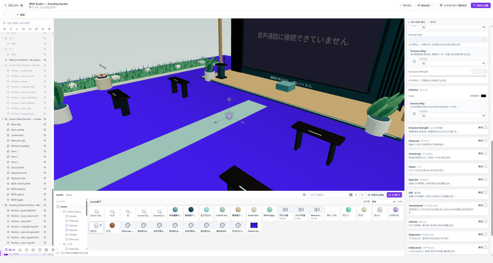

# Clearcoat・Iridescenceなどを使う

[Base Color、Metallic、Roughness](./materials.md)で基本の表面を作ったあと、必要な拡張を有効にしてください。glTFなどの資料と照合できるよう、項目名には英語を使っています。

ここでは「Shading → マテリアルの種類」がStandard (PBR)の場合を説明します。マンガのような陰影や輪郭線には、[MToon](./materials.md#mtoonマンガのような陰影と輪郭線を付ける)を使ってください。

*使いたい表現に合わせて、必要な拡張を有効にしてください。*

## Clearcoat

Clearcoatでは、塗装やニスのような透明な光沢の層を重ねられます。下地のRoughnessと、上塗りのRoughnessは別に調整できます。

ClearcoatのNormal Mapも、上塗りの層だけに使われます。まず上塗りの量と粗さを変えて、見た目を比べてください。

## Iridescence

Iridescenceでは、薄膜によって反射色が見る角度で変わる表現を作れます。設定後は、視点を動かして確かめてください。

Thickness Min / Maxは薄膜の厚みで、単位はnmです。マップを使わない場合はMaxが適用されます。ここでのIORは薄膜の屈折率を表し、素材本体のIORとは別の設定です。

VolumeのThicknessはメッシュ内の距離、IridescenceのThicknessは薄膜の厚みです。数値を移す場合は、それぞれの単位と意味を確認してください。

## Sheen・Anisotropy・Specular

| 拡張 | 表現できること |
| --- | --- |
| Sheen | ベルベットのような、柔らかな布の光沢を加えます。 |
| Anisotropy | 筋のある金属のように、反射を一方向に伸ばします。 |
| Specular | 非金属の反射の強さと色を調整します。金属度を設定するMetallicとは別です。 |

## Transmission・Volume・Dispersion

Transmissionは光の透過、Volumeは厚みと光の減衰を扱います。まず[透明な素材の手順](./transparent-materials.md)を参照してください。

Dispersionでは、透過光を色ごとに分けられます。有効にするとVolumeとTransmissionも有効になるため、透過や厚みの設定も確認してください。

## Unlit

Unlitを有効にすると、ライトの影響を受けずに表示されます。併用できない反射や透過の設定は解除されます。

Roughnessなどによる反射の違いを比べる場合は、Unlitをオフにしてください。

## ほかのツールから値を移すとき

Base ColorとDiffuse Colorは、同じ意味とは限りません。Base Colorは、金属の反射色も扱います。

RoughnessとSmoothnessは増減の向きが逆です。同じ値をコピーする前に、シェーダーと画像のチャンネルを確認してください。

ClearcoatとCoat、IridescenceとThin Filmは、対応する表現を探す手掛かりになります。ただし、名前を置き換えるだけで同じ描画結果になるとは限りません。
