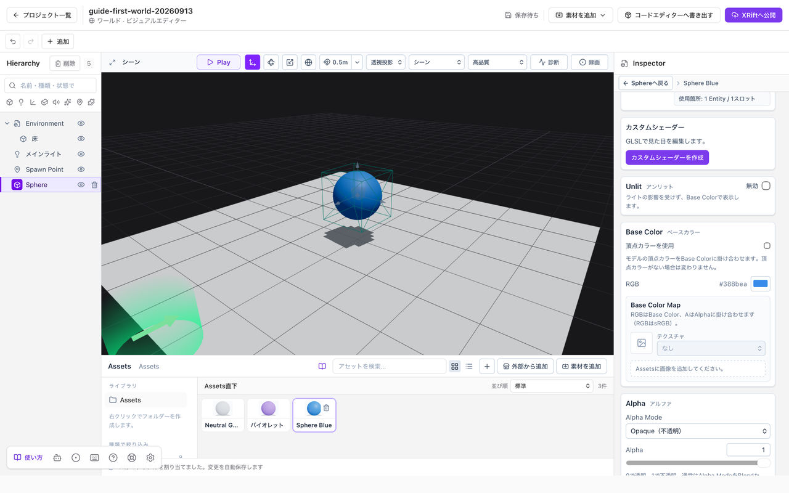
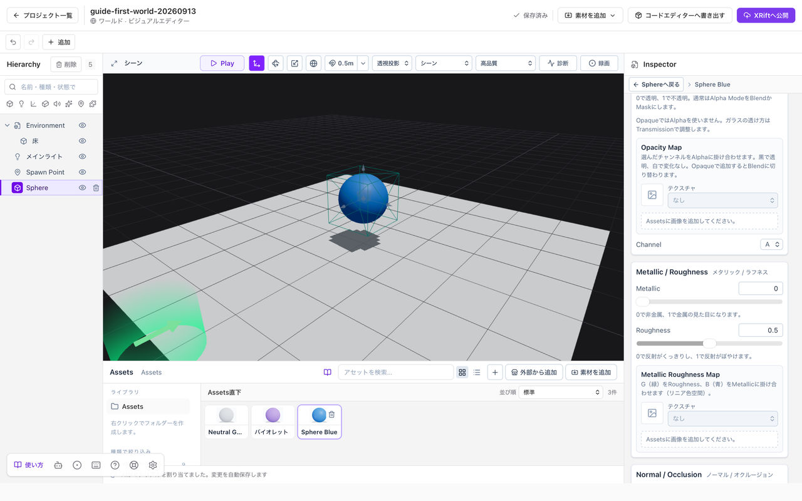

# 色と質感を変える

**マテリアル**は、物の表面の色や光の反射を決める素材です。最初は**Base Color・Metallic・Roughness**の三つだけ使いましょう。

**始める前に：** シーンに球などを一つ配置し、Play中なら**Stop**で編集に戻ってください。

*Assetsでマテリアルを選ぶと、右のInspectorにBase Colorが表示されます。*

## 作って割り当てる

1. **Assets**の追加メニュー、または空いている場所の右クリックから**新規マテリアル**を選びます。
2. 作ったマテリアルをAssetsで選び、Inspectorの**Base Color**を変えます。
3. **Hierarchy**で色を付けたいEntityを選びます。
4. **Inspector → Mesh Renderer → マテリアル**で、作ったものを選びます。Assetsからこの欄へドラッグしても割り当てられます。

**色が変わったら、割り当ては完了です。** 作っただけで反映されない場合は、四つ目の操作を確認してください。複数のスロットがあるモデルでは、対象の面に対応するスロットへ割り当てます。

## Base Color：色を決める

Base Color（ベースカラー）は、非金属では表面の色、金属では反射の色を変えます。

まずはMetallicを0にして、Base Colorを変えてみてください。画像も割り当てられている場合は、画像の色とBase Colorが掛け合わされます。画像の色をそのまま使う出発点は白です。

*RGBの右にある色の欄から変更します。*

## Metallic：金属かどうかを決める

Metallic（メタリック）は、**0で非金属、1で金属**です。プラスチックや塗装面ならまず0、金属の露出した面ならまず1を試します。

値を上げれば何でもきれいになる設定ではありません。金属が暗く見える場合は、値だけでなく[照明とIBL](./lighting.md#金属が暗い反射が見えない)を確認してください。

*左の説明と右の数値を確認して、一つずつ調整します。*

## Roughness：反射のぼけ方を決める

Roughness（ラフネス）は、**0に近いほど反射がくっきり、1に近いほど反射がぼやける**設定です。形状をでこぼこにするものではありません。

同じ色の球で、まず**0.15**と**0.8**を比べてみてください。反射する環境やライトによって見え方が変わるため、これは調整を始めるための例です。

### 設定の出発点

**つやのあるプラスチック：** Metallic 0、Roughness 0.2から試します。

**つやを抑えた面：** Metallic 0、Roughness 0.8から試します。

**磨いた金属：** Metallic 1、Roughness 0.15から試し、IBLなど反射する環境も用意します。

これらの数値だけで特定の素材を完全に再現できるわけではありません。模様や細かな凹凸は[テクスチャ](./textures.md)で加えます。

## 一つだけ色を変える

**同じマテリアルを使うEntityは、変更がまとめて反映されます。** Inspectorの使用箇所を確認してから編集してください。

一つだけ変える場合は、新しいマテリアルを作り、そのEntityにだけ割り当てます。Entityを複製しただけでは、マテリアルが独立するとは限りません。

## 質感が変わらないとき

まず**Stop**していること、編集したマテリアルを対象に割り当てたこと、変更したいスロットを選んだことを確認します。

それでも違いが分かりにくい場合は、表示モードを**シーン**に戻し、ライトやIBLを確認します。**Unlit**が有効なマテリアルはライトの影響を受けません。

## 基本の次に進む

模様は[テクスチャ](./textures.md)、ガラスや半透明は[透明な素材](./transparent-materials.md)、ClearcoatやIridescenceは[マテリアルの拡張](./material-extensions.md)で扱います。最初からすべての項目を変更する必要はありません。
