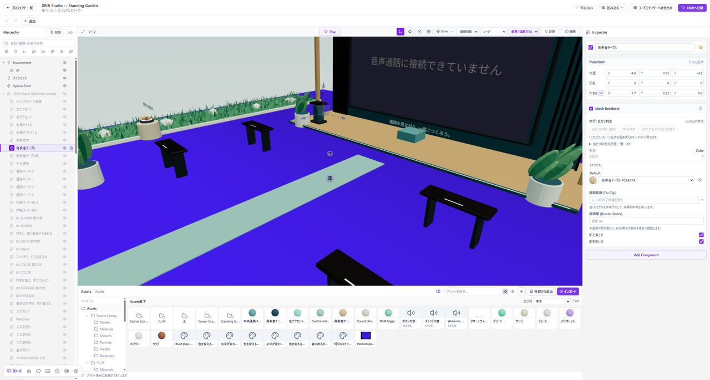

# 配置・移動・整理する

Entityを選んでから、移動・回転・大きさを調整します。Assetsの素材そのものを変更する操作とは分けて考えてください。

*Entityを選ぶとInspectorのTransformで位置・回転・大きさを確認できます。*

## 物を配置する

基本形状は**追加 → Primitive**から選びます。取り込んだモデルは、**Assets**から中央のシーンへドラッグします。配置するとHierarchyにEntityが増えます。

## 位置・回転・大きさを変える

1. シーンまたはHierarchyでEntityを選びます。
2. Inspectorの**Transform**を開きます。
3. X・Y・Zの数値を変えます。Yが上下方向です。回転は画面に表示される度数で入力します。

移動ツールの矢印、回転ツールの輪、拡縮ツールのハンドルをドラッグしても変更できます。正確にそろえたいときは、数値入力を使ってください。

見た目だけを変えたいときに、位置の数値を触る必要はありません。色はマテリアル、明るさはライトやシーン設定で調整します。

## 複製する

Hierarchyの右クリックメニューから**複製**します。同じものが重なって見える場合は、複製した方を移動してください。

複製したEntityは、元と同じマテリアルを参照していることがあります。片方だけ色を変えたい場合は、[マテリアルを分ける](./materials.md#一つだけ色を変える)必要があります。

## 親子にまとめる

HierarchyでEntityを別のEntityの下へドラッグすると、親子関係を作れます。机の下に小物をまとめる、といった整理に使います。

親を移動・回転・拡大縮小すると、子も一緒に変わります。子の数値だけを見て予想と違う場合は、親の変形も確認してください。

## 削除と取り消し

選んだEntityを削除すると、シーンからなくなります。**Assetsの素材を削除する操作とは別です。** 素材の削除では、ほかのEntityの参照にも影響することがあります。

間違えた直後は**Ctrl + Z**（Macは**⌘ + Z**）で元に戻します。大きな変更の前は、[プロジェクトの複製やZIP保存](./save-and-open.md#バックアップする)を使ってください。
