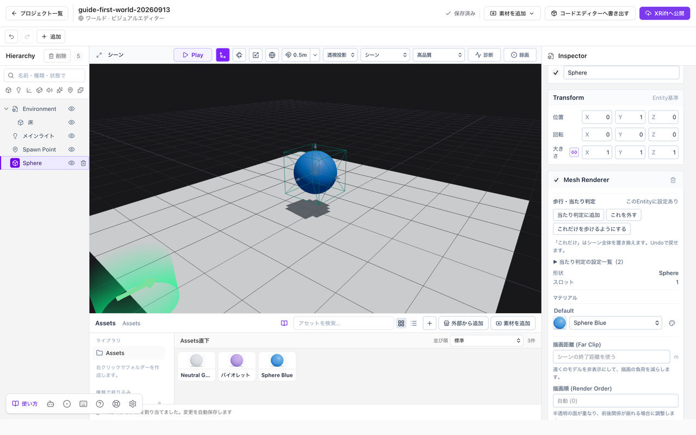

# 配置・移動・整理する

動画で操作を確認する：[オブジェクトを移動・拡大縮小する](./lesson-01-02.md) / [複製とUndo・Redoを使う](./lesson-01-04.md)

シーンに置いたEntityは、選択してから位置、回転、大きさを調整できます。色や質感を変えるには、Assetsのマテリアルを編集します。

*画像のSphereは、位置がX 0、Y 1、Z 0です。Hierarchyで移動したいEntityを選んでください。*

## 物を配置する

基本形状を置くには、上部の「素材を追加 → Entityを作成 → 基本形状」から選んでください。取り込んだモデルは、Assetsから中央のシーンへドラッグします。配置したEntityは、Hierarchyにも表示されます。

## 位置・回転・大きさを変える

シーンかHierarchyでEntityを選び、InspectorのTransformを開いてください。X・Y・Zの数値で位置や大きさを調整できます。Yは上下方向です。回転の値は、画面に表示される度数で入力してください。

移動ツールの矢印、回転ツールの輪、拡縮ツールのハンドルをドラッグしても調整できます。位置や角度を正確にそろえるには、数値を入力してください。

大きさのX・Y・Zは、初期状態では個別に変更できます。比率を保って拡大・縮小するには、大きさの横の鎖ボタンで「Scale比率を固定」を有効にしてください。

色はマテリアル、明るさはライトやシーン設定で調整してください。これらの調整では、Entityの位置を変える必要はありません。

## 複製する

シーン上のEntityかHierarchyの行を右クリックし、「複製」を選んでください。元のEntityと重なっている場合は、複製したEntityを移動します。

複製したEntityが、元のEntityと同じマテリアルを使っている場合があります。一つだけ色を変えるには、[マテリアルを分けてください](./materials.md#一つだけ色を変える)。

## コピーして貼り付ける

シーン上のEntityかHierarchyの行を右クリックし、「コピー」を選んでください。次にシーンかHierarchyで右クリックし、「貼り付け」を選びます。コピーするまでは「貼り付け」を選べません。

反転したコピーを作るには、「反転して貼り付け → X軸 / Y軸 / Z軸」を選んでください。選んだ軸だけ大きさの符号を変えたEntityが追加されます。Inspectorで大きさの比率を固定していても使えます。

反転の基準は、各Entityのローカル軸です。位置と回転は変わらないため、門の反対側などに置く場合は、貼り付けたEntityを移動してください。貼り付け後は新しいEntityが選択され、元のEntityはそのまま残ります。

複数のEntityを選んで、まとめてコピーすることもできます。親と子を両方選んでも、子が二重に複製・反転されることはありません。アニメーション付きモデルのBoneなど、単独では表示できないノードを含む場合は、Hierarchyでモデル全体を選んでコピーしてください。

貼り付けたEntityは、選択中のEntityと同じ親の下に追加されます。何も選んでいなければシーン直下に追加されます。「複製」では、それぞれの元の親が維持されます。貼り付け・複製は、一回のUndoで取り消せます。

基本形状は上部の「素材を追加 → Entityを作成」か、Hierarchyの右クリックメニューから作れます。モデルはAssetsから配置してください。シーンの右クリックメニューには、コピーや複製などの編集操作があります。

## 親子にまとめる

HierarchyでEntityを別のEntityの下へドラッグすると、親子関係を作れます。たとえば机を親にして、小物を子としてまとめられます。

親を移動・回転・拡大縮小すると、子も一緒に変わります。子の位置や大きさが入力値から予想した状態と違うときは、親のTransformも確認してください。

## 削除と取り消し

Entityを削除すると、シーンから取り除かれます。Assetsの素材は残りますが、その素材をAssetsから削除すると、同じ素材を使うほかのEntityにも影響する場合があります。

間違えた直後は、Ctrl + Z、Macでは⌘ + Zで元に戻せます。大きな変更の前は、[プロジェクトの複製や.xriftstudioへの書き出し](./save-and-open.md#バックアップする)でバックアップしてください。
