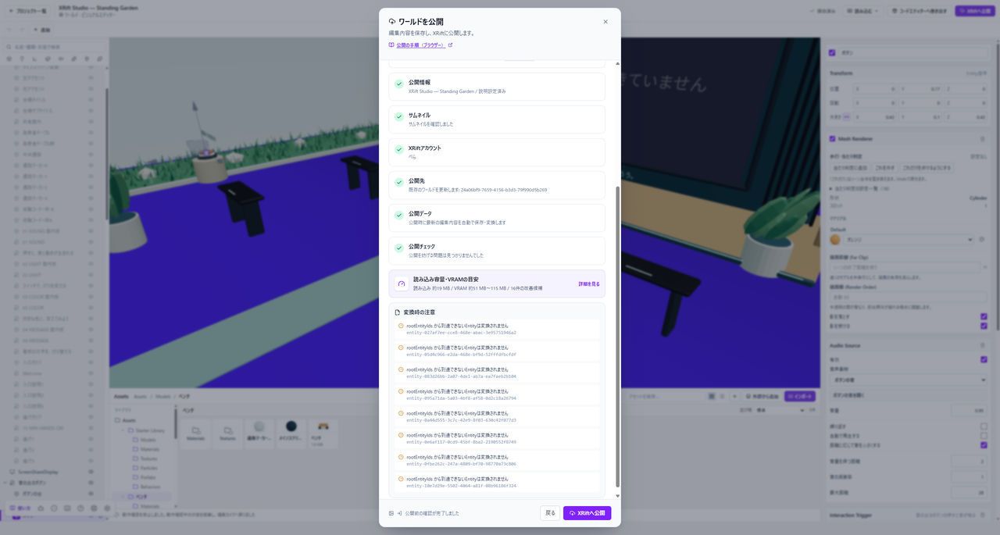

# 容量と描画負荷を減らす

**ファイルの容量が大きいこと**と、**表示の処理が重いこと**は別です。どちらで困っているかを確かめてから調整します。

*容量と負荷の大きい順に内訳を見て、効果の大きい対象から調整します。*

## 公開前の見積りを見る

**XRiftへ公開**の確認画面で、初回ロードの容量、回線別の推定時間、素材や実行時VRAMの目安を確認します。見積りは保証値ではありません。

容量や負荷の大きい順の内訳から、効果が大きそうな対象を選びます。小さなファイルを無差別に削るより、まず上位の素材を確認してください。

## 画像とモデルを調整する

公開前の最適化では、解像度の縮小、KTX2圧縮、Draco圧縮などの候補を個別に選びます。適用後は、変換結果と見積りを確認してから公開の確認画面へ戻ります。

細かな文字がある画像を縮小すると、読めなくなることがあります。容量だけでなく、実際の見た目を確認してください。

**編集にもこの設定を適用**を使う場合は、元画像を残し、変換した画像を編集にも使います。適用後の表示を確認してから作業を続けます。

## 表示が重いとき

影を出すライト、重なる半透明、パーティクルの数や大きさ、Post Processing、表示するモデルの量を一つずつ見直します。

いくつも同時に変えると、何が効いたか分からなくなります。変更前の状態を残し、同じ位置から比べてください。

## 編集画面だけ軽くする

エディターの描画品質を下げると、編集中の負荷を抑えられます。これは公開した作品の品質を下げる設定ではありません。

軽量な表示では影やBloomが省かれるため、完成前には高品質表示とPlayでも確認してください。

## 実際の端末で確かめる

自分のパソコンで軽くても、ほかの端末で同じとは限りません。公開後のロード時間、操作の反応、見た目を、使ってもらう端末でも確認します。
