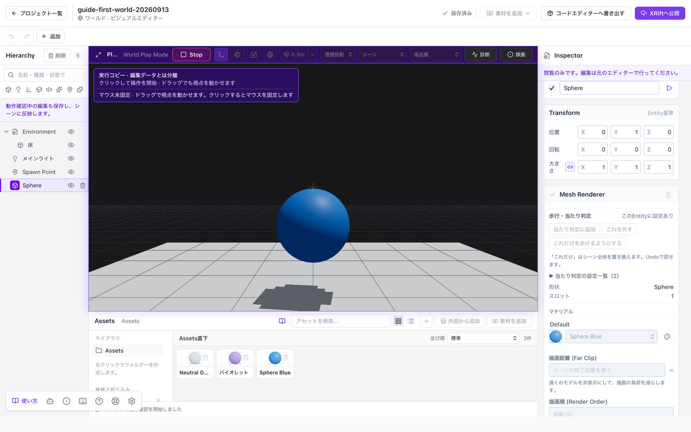

# Playで動作を確かめる

**Play**でワールドに入り、**Stop**で編集へ戻ります。公開する前に、床の上を歩けるか、見た目や仕掛けに問題がないか確認します。

## 操作を始める

1. エディターの**Play**を押します。
2. モデルの読み込みが終わるまで待ちます。
3. 中央の**Play Window**をクリックして操作を始めます。

ワールドではプレイヤー視点で移動できます。アイテムでは、ワールドの移動を前提にせず単体の見え方を確認します。

*実行中は中央がPlay Windowに変わります。上部のStopで編集へ戻れます。*

## 歩く・見る・操作する

**WASD・矢印キー：** 移動します。

**マウス：** 見る方向を変えます。マウス固定を使えない環境では、画面のドラッグでも視点を動かせます。

**Space・E：** ジャンプします。

**クリック：** 手の届く仕掛けを操作します。**G**は掴む・置く、掴んでいる間のホイールは距離の調整です。

**Esc：** マウス固定を解除します。解除直後に固定し直せないときは、少し待ってからクリックしてください。

## 編集へ戻る

**Stop**を押します。マウス固定が外れ、編集の選択や視点へ戻ります。

実行中のプレイヤーの位置や物理の速度は、保存するシーンへ書き戻されません。仕掛けが一時的に変えた値と、Inspectorで編集した保存対象の値は別です。

## Play中に変更できないもの

マテリアル、素材、シーン設定は、**Stopしてから**編集します。ドラッグでの素材配置やギズモ操作も編集モードで行ってください。

位置・回転・大きさなど、一部のInspector操作はPlay中も編集データを変えます。その編集は履歴や自動保存に入るため、Play中なら何を変えても保存されない、とは考えないでください。

## 床から落ちる・出現位置がおかしい

**Stop**し、[床の衝突判定と開始位置](./collision.md)を確認します。床が見えることと、プレイヤーが床に乗れることは別です。

## 公開前に確かめること

入口から歩けること、見る角度を変えても問題がないこと、仕掛けを押して動くことを確認します。

複数人での同期、画面共有、端末ごとの権限などは、一人のPlayだけで確認が済むわけではありません。必要な機能は公開先でも実際の利用条件で確認してください。

## VehicleとSeatを試す

1. Assetsの**外部から追加 → XRift公式コンポーネント**を開きます。
2. VehicleまたはSeatのカードを選び、**Vehicleをシーンへ追加**または**Seatをシーンへ追加**を押します。車体や椅子が、操作に必要な設定と一緒にシーンへ配置されます。
3. Hierarchyで配置したものを選び、床の上の使いたい位置へ移動します。
4. **Play**を押し、近づいて座席をクリックします。

Vehicleは、車の進行方向に向かって左の座席が運転席です。**運転する**と表示される座席をクリックし、W/Sで前後、A/Dで旋回します。Spaceで降ります。

同乗席とSeat単体は、座って視点を確認できます。Inspectorで速度・旋回速度・座面の高さを調整できます。配置や設定の変更は自動保存されます。

この車体は操縦処理のサンプルです。衝突判定や地形への接地処理を追加する場合は、生成されたTSXを編集します。
Studioで試せるのはWorld Playのローカル操作です。複数人への車体の同期や、後から入室した人からの見え方はXRift上で確認してください。
