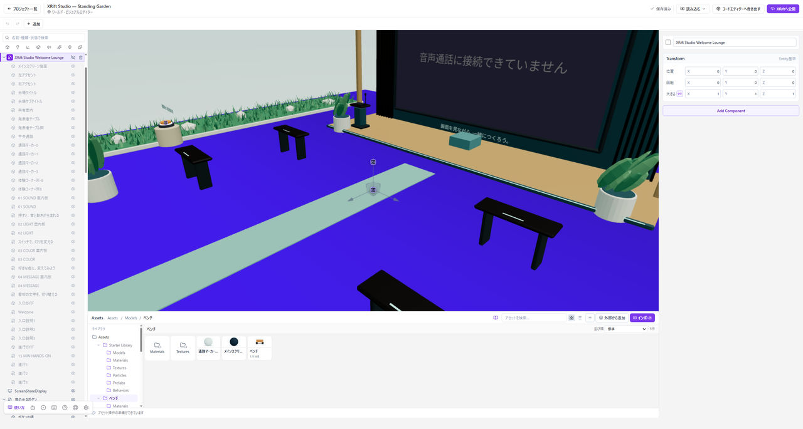

# 組み合わせをプレハブにする

**プレハブ**は、Entityとその子をまとめて再利用するための素材です。同じ家具、看板、仕掛けを何度も置くときに使います。

*左のHierarchyで親子関係を確認できます。プレハブへの保存は、このあとAssetsへドラッグして行います。*

## 組み合わせを作る

Hierarchyで、まとめたいEntityを一つの親の下に整理します。親を動かしたときに全体が一緒に動くか確認してから、プレハブにしてください。

## Assetsへ保存する

まとまりの親Entityを**HierarchyからAssetsへドラッグ**します。Entityと子を含むプレハブとして保存します。

保存したプレハブをシーンへ配置し、元と同じ構成になることを確認します。

## 変更を反映する

配置したプレハブに変更を加えたときは、**その配置だけの変更**と、**元のプレハブへ反映する変更**を区別します。

**プレハブに反映**を使う前に、同じプレハブをほかにも使っていないか確認してください。まとめて変更したくない場合は、先にプロジェクトをバックアップします。

## 素材の共有にも注意する

プレハブを別々に配置しても、マテリアルなどを共有している場合があります。一つだけ違う色にする場合は[マテリアルを分ける](./materials.md#一つだけ色を変える)手順を使います。
