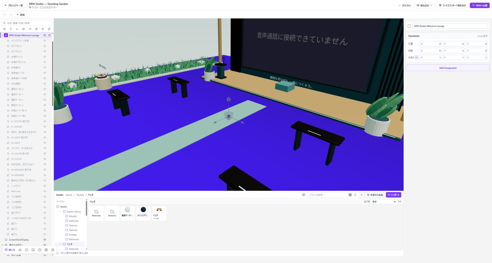

# 組み合わせをプレハブにする

動画で操作を確認する：[Prefabを作って再利用する](./lesson-02-08.md)

プレハブは、親子のEntityをまとめて再利用するための素材です。同じ家具、看板、仕掛けを繰り返し置くときに使えます。

*Hierarchyで親子関係を確認し、親EntityをAssetsにドラッグするとプレハブにできます。*

## 組み合わせを作る

Hierarchyで、まとめたいEntityを一つの親の下に整理してください。親を動かすと全体が一緒に動くことを確認してから、プレハブにします。

## Assetsへ保存する

親EntityをHierarchyからAssetsへドラッグしてください。子Entityも含むプレハブとして保存されます。

保存したプレハブをシーンに置き、元と同じ構成になっているか確認してください。

## 変更を反映する

配置したプレハブを編集すると、その配置に変更が保存されます。元のプレハブにも反映するには、「プレハブに反映」を使ってください。

反映前に、同じプレハブをほかの場所でも使っているか確認します。ほかの配置への影響に備えるには、先にプロジェクトをバックアップしてください。

## 素材の共有にも注意する

別々に配置したプレハブでも、同じマテリアルを使っている場合があります。一つだけ色を変えるには、[マテリアルを分けてください](./materials.md#一つだけ色を変える)。
