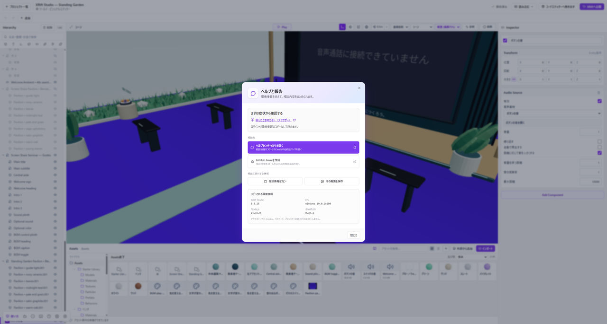

# データを守って復旧・問い合わせする

不具合が起きたら、まず残せる作品データをバックアップしてください。完全リセットは、データを確認したあとに検討します。

*作品を保存してバックアップし、「ヘルプと報告」で問い合わせの情報を用意してください。*

## 先に確認する

保存できる場合は、プロジェクトを複製するか.xriftstudioファイルに書き出してください。保存エラーが出ている間は編集画面を閉じず、エラーの内容を確認します。

パネルの配置にだけ問題がある場合は、エディターのヘルプから「パネル配置を初期化」を使ってください。

## 問い合わせに残す情報

何をしようとして、どの画面で何を押し、何が起きたかを短くまとめてください。エラーの文面、アプリのバージョン、OSも添えると、状況を確認しやすくなります。

アプリの「ヘルプと報告」では、相談情報のコピーとスクリーンショットの保存ができます。送る前に、内容を読み直してください。

## 送らない情報

ログイン用トークン、APIキー、パスワード、個人情報、第三者の非公開データは含めないでください。スクリーンショットに写る別ウィンドウやファイル名も確認してください。

## 公開の結果が分からない場合

XRiftで公開状況を確認してから、再送するか判断してください。エラーが表示されても、送信が済んでいる場合があります。操作は[公開の復旧手順](./publishing.md#送信結果が分からない)を参照してください。

## 完全リセットは最後にする

完全リセットでは、アプリ専用の実行環境、保存済みプロジェクト、ログイン情報などが削除され、元に戻せません。実行前に、削除範囲とバックアップを確認してください。

判断できない場合は、リセット前に問い合わせてください。利用ガイドには、リセットを実行するボタンはありません。

## 不具合を報告する

[XRift Studioの不具合報告先](https://github.com/WebXR-JP/xrift-studio/issues)で同じ問題が報告されているか確認し、見つからなければ報告してください。通常の利用に、GitHubの開発手順を読む必要はありません。
