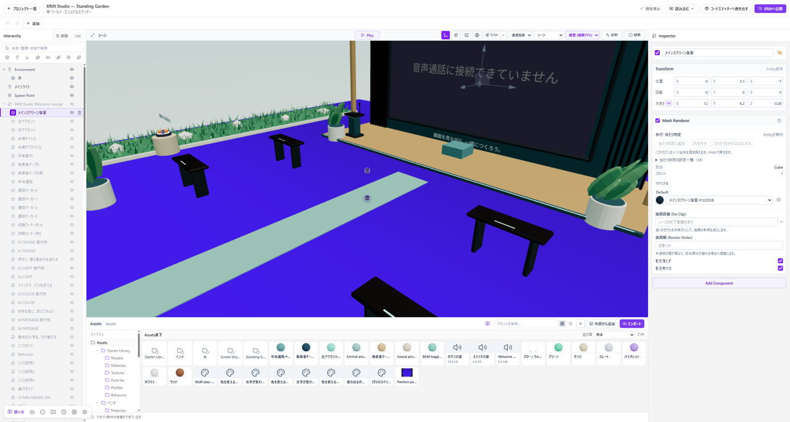

# 鏡・動画・画面共有を置く

鏡、動画プレイヤー、画面共有などは、ワールドで使う機能の**Component**として追加します。モデルのスクリーンを置くだけでは、動画や画面共有は動きません。

*鏡・動画・画面共有はComponentとして配置し、向きと大きさを調整します。*

## 機能を選んで配置する

1. **Assets → 外部から追加 → Component**を開きます。
2. 鏡、動画プレイヤー、画面共有など、使いたい機能を選びます。
3. 詳細の説明と入力項目を確認して追加します。
4. 配置したEntityを選び、位置と大きさ、機能ごとの設定を調整します。

画面の前に立つ位置や、複数人で見る距離も考えて配置してください。

## Playで配置と操作を確かめる

**Play**で、画面の向き、大きさ、操作する場所への届きやすさを確認します。壁や別の面に埋まっていないかも見てください。

動画のURLなど必要な設定がある機能では、画面の入力条件を確認してください。WebページのURLと、再生できる動画のURLは同じとは限りません。

## 公開先でも確認する

画面共有は、利用するブラウザや端末の対応、画面を選ぶ権限などにも左右されます。**一人のPlayで表示されたことを、すべての端末や複数人での動作保証にしないでください。**

公開したワールドへ実際に入り、共有を始める人と見る人の両方で確認します。機能ごとの同期や利用条件は、公式Componentの説明と実際の画面に従ってください。

## 表示されないとき

Componentが有効か、必要な設定が入っているか、画面が裏向きや壁の中になっていないかを確認します。権限の拒否やURLのエラーがある場合は、先にその原因を解消してください。
