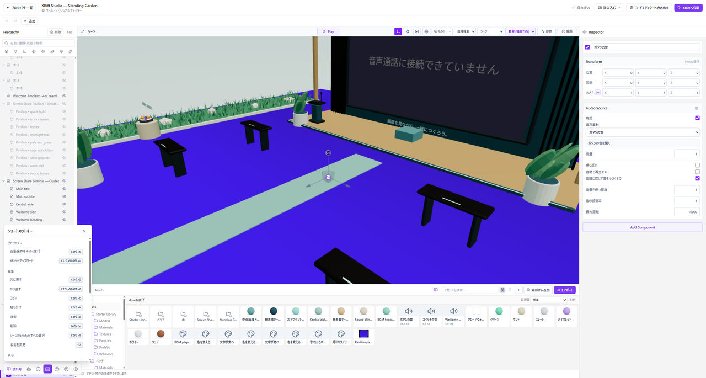

# よく使うショートカット

まずは、保存・取り消し・視点合わせ・Playの四つを覚えると操作しやすくなります。文字を入力しているときは、その入力欄がキーを使う場合があります。

*そのほかの操作は左下のショートカットキー一覧で現在の組み合わせを確認します。*

## 保存する

**Ctrl + S**。Macは**⌘ + S**です。保存状態も確認してください。

## 元に戻す

**Ctrl + Z**。Macは**⌘ + Z**です。大きな作り替えの前は、取り消しだけに頼らずバックアップも残します。

## 選んだものへ視点を合わせる

シーンまたはHierarchyでEntityを選び、**F**を押します。選んだものが画面の外にあるときに便利です。

## Playを始める・止める

**Ctrl + Enter**。Macは**⌘ + Enter**です。**F6**でもPlayを開始できます。画面上のPlay・Stopボタンも使えます。

## マウス固定を解除する

Play中に**Esc**を押します。マウス固定を解除する操作と、PlayをStopする操作は別です。

## そのほかの操作

エディター左下の**ショートカットキー一覧**で、現在の操作名とキーの組み合わせを確認してください。ノードエディターとシーンでは、同じキーでも対象が異なる場合があります。
