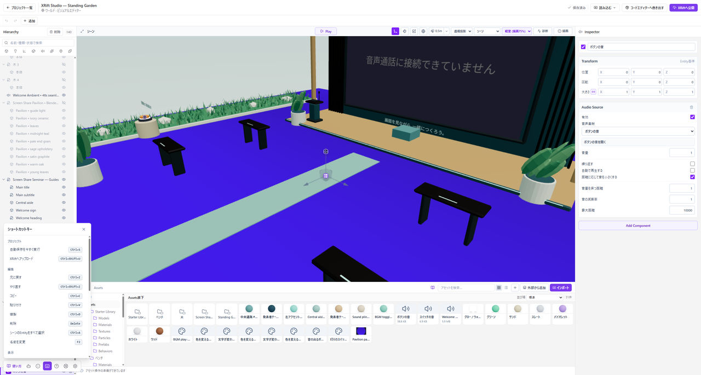

# よく使うショートカット

取り消し、視点合わせ、Playのキーを覚えると、よく使う操作をすぐに実行できます。文字の入力中は、入力欄の操作が優先される場合があります。

*左下の「ショートカットキー一覧」で、現在のキーの組み合わせを確認できます。*

## すぐに保存する

編集内容は自動保存されます。すぐに保存するには、Ctrl + S、Macでは⌘ + Sを押してください。

## 元に戻す

Ctrl + Z、Macでは⌘ + Zで取り消せます。大きな変更の前は、バックアップも残してください。

## 選んだものへ視点を合わせる

シーンかHierarchyでEntityを選び、Fを押してください。画面の外にあるEntityにも視点を合わせられます。

## Playを始める・止める

Ctrl + Enter、Macでは⌘ + Enterで切り替えられます。F6でもPlayを開始できます。画面上のPlayとStopも使えます。

## マウス固定を解除する

Play中にEscを押してください。マウス固定は解除されますが、Playは続きます。編集に戻るにはStopを押してください。

## そのほかの操作

エディター左下の「ショートカットキー一覧」を参照してください。ノードエディターとシーンでは、同じキーでも操作の対象が異なる場合があります。
