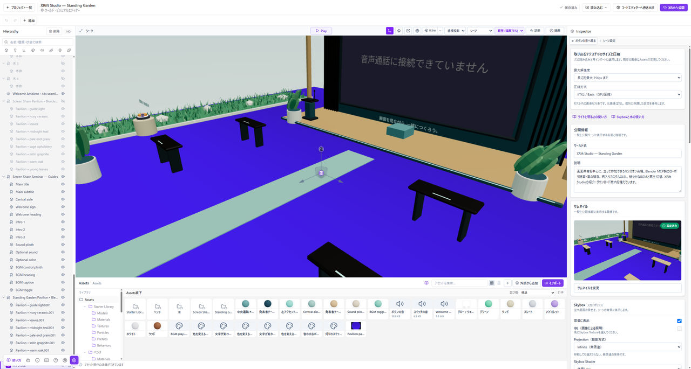

# 空と水を作る

空は**Skybox**、水面は**Water Shaderのマテリアル**を使って作ります。それぞれ割り当て先が違います。

*Skyboxを設定すると背景が変わります。照明に使う場合はIBLを別に設定します。*

## Skybox Shaderを背景にする

1. **Assets → 外部から追加 → Skybox Shader**を開きます。
2. プリセットを選び、詳細の見本を確認します。
3. **追加後にSkyboxへ設定**を有効にして追加します。
4. シーンの背景が変わったことを確認します。

チェックを外した場合はマテリアルだけが追加されます。追加済みのマテリアルはカタログの**Skyboxに設定**、またはシーン設定から割り当てます。Skybox ShaderはSkybox Textureより優先して背景を描きます。

## 空の色や動きを変える

追加されたマテリアルをAssetsで選び、Inspectorの**調整できる値**で変更します。雲、太陽、色など、変更できる項目はプリセットごとに異なります。

**既定値へ戻す**で調整を戻せます。同じプリセットを追加し直す場合も既存の値が上書きされることがあるため、残したい作品は先にバックアップしてください。

## 背景と照明を分けて設定する

**Skybox**は背景、**IBL**は画像を照明や反射に使う設定です。Skybox Shaderを追加しただけでは、周囲の照明や反射は変わりません。

**シーン設定 → Skybox**で**Skybox Texture**にHDRIなどを選び、必要に応じて**IBL**を有効にしてください。**Intensity**は背景とIBLの明るさ、**Rotation**は水平方向の調整です。Shader側への反映は、そのShaderが対応する設定によります。

Skybox Shaderは編集中も表示されます。背景が見えないときは、表示モードを**シーン**に戻してください。**Unlit**や**Wireframe**ではSkyboxを表示しません。

## 水面を作る

1. **外部から追加 → Water Shader**でプリセットを選び、マテリアルへ追加します。
2. 水面にする水平なメッシュを用意します。
3. そのEntityの**Mesh Renderer → マテリアル**に、追加したWater Shaderを割り当てます。
4. マテリアルを選び、Inspectorの**調整できる値**で波や色を調整します。

分割していない平面では、**頂点変位**を0にします。波の輪郭も上下させる場合は、十分に分割したメッシュが必要です。

## 風と波の関係

水面の波は**シーン設定の風**を使います。プリセットの波の速さは、その風に対する倍率です。0にすると水面が止まります。カタログの**試し風**はプレビュー専用で、シーン設定を書き換えません。

## 見た目と物理を区別する

水のマテリアルを割り当てても、泳げる領域や浮力、岸の衝突判定が自動でできるわけではありません。

岸の泡は設定した位置・方角・幅による演出で、地形や岩との接触を自動検出しません。反射は空色の近似で、物体の鏡映や実際の水深を扱うものではありません。必要な移動範囲や床は別に用意してください。
