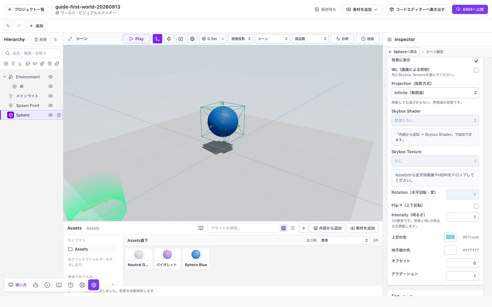

# 空と水を作る

空の背景にはSkybox、水面にはWater Shaderのマテリアルを使います。背景とメッシュに、それぞれ割り当ててください。

*画像では、上空と地平線の色で背景を作っています。背景画像は使っておらず、IBLも無効です。*

## 360度ペイントのPNGを背景にする

1. 「Assets → ファイルから素材を追加」で、360度ペイントなどから書き出したPNG / JPEGを取り込みます。横:縦が2:1の全天球画像（Equirectangular）を使ってください。HDR / EXRも使えます。
2. 「シーン設定 → Skybox」を開き、「Skybox Texture」で取り込んだ画像を選びます。Assetsからこの欄へドロップしても割り当てられます。
3. 「背景に表示」を有効にします。Skybox Shaderが設定されている場合は、Shaderを「なし」にすると画像が背景に表示されます。
4. Rotationで向きを合わせ、上下が逆ならFlip Yを切り替えます。明るさはIntensityの1を基準に調整してください。

画像を使うためにマテリアルやCubeを作る必要はありません。Skybox Textureには、6面を並べたキューブマップではなく、1枚の全天球画像を指定してください。IBLは照明と反射にも画像を使いたい場合に有効にします。

以前のサイズ・圧縮設定は引き継がず、今後の取り込み設定だけを初期値に戻します。取り込み済みの画像は変更しません。

取り込みの初期設定は「原寸のまま」「画像形式を維持・圧縮しない」です。縮小・圧縮を自分で選んだ場合は、次の取り込みにもその設定が使われます。

以前の取り込みでKTX2に変換され、画像が表示されない場合は、Assetsでそのテクスチャを選び、Inspectorの「元の画像に戻す」で保持されている原本へ戻してください。元画像が残っていない場合は、取り込み設定を確認して元のPNG / JPEGを追加し、Skybox Textureに選び直します。

## Skybox Shaderを背景にする

「Assets → 外部から追加 → Skybox Shader」を開き、プリセットの見本を確認してください。「追加後にSkyboxへ設定」を有効にして追加すると、シーンの背景が変わります。

チェックを外すと、マテリアルだけが追加されます。追加済みのマテリアルは、カタログの「Skyboxに設定」かシーン設定から割り当ててください。Skybox Shaderは、Skybox Textureより優先して背景を描画します。

## 空の色や動きを変える

Assetsで追加されたマテリアルを選び、Inspectorの「調整できる値」を変更してください。雲、太陽、色など、調整できる項目はプリセットによって異なります。

「既定値へ戻す」で、設定を初期状態に戻せます。同じプリセットを追加し直すと、既存の値が上書きされる場合もあります。今の状態を残すには、先にバックアップしてください。

## 背景と照明を分けて設定する

Skyboxは背景を表示し、IBLは画像を照明や反射に使います。Skybox Shaderを追加するだけでは、周囲の照明や反射は変わりません。

「シーン設定 → Skybox」でSkybox TextureにHDRIなどを選び、必要に応じてIBLを有効にしてください。Intensityは背景とIBLの明るさ、Rotationは水平方向の向きを調整します。Shaderにも反映されるかは、そのShaderの対応状況によります。

Skybox Shaderは編集中も表示されます。背景が見えない場合は、表示モードを「シーン」に戻してください。UnlitとWireframeでは、Skyboxは表示されません。

## 水面を作る

「外部から追加 → Water Shader」で、プリセットをマテリアルに追加してください。水面にする水平なメッシュを用意し、そのEntityの「Mesh Renderer → マテリアル」に割り当てます。マテリアルを選ぶと、Inspectorの「調整できる値」で波や色を変えられます。

分割していない平面では、「頂点変位」を0にしてください。波の輪郭も上下させるには、十分に分割したメッシュが必要です。

## 風と波の関係

波には、シーン設定の風が使われます。プリセットの波の速さは、風に対する倍率です。0にすると波が止まります。カタログの「試し風」はプレビューにだけ使われ、シーン設定は変わりません。

## 見た目と物理を区別する

水のマテリアルを割り当てても、泳ぐ領域、浮力、岸のColliderは自動では作られません。必要な移動範囲や床は、別に用意してください。

岸の泡は、設定した位置、方角、幅で表示されます。地形や岩との接触は自動検出されません。反射には空色の近似が使われ、物体の鏡映や実際の水深は反映されません。
