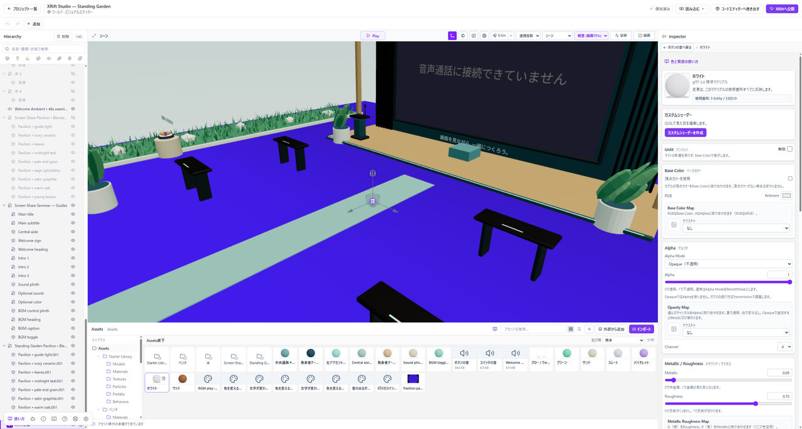

# テクスチャで模様を付ける

テクスチャは、色や細かな凹凸を表す画像です。まず[マテリアルを作って割り当てる](./materials.md#作って割り当てる)手順を済ませてください。

*InspectorのBase Color Mapで、色に使う画像を選べます。*

## 色の画像を貼る

PNGやJPGなどの画像をAssetsに取り込み、使いたいマテリアルを選んでください。Base Color Mapで画像を指定し、Base Colorを白にして画像の色を確認します。

画像の色には、Base Colorが掛け合わされます。暗くなったり色が変わったりする場合は、Base Colorとライトの設定を確認してください。

## 貼る大きさや向きを変える

マテリアルのテクスチャ設定で、繰り返し、位置、回転を調整できます。画像を選ぶと、繰り返し方やフィルターも確認できます。

画像をモデルのどこに貼るかは、モデルのUVで決まります。UVがない場合や配置が意図と違う場合は、モデルを作ったツールで確認してください。画像の差し替えだけでは直せません。

## Normal Mapで細かな凹凸を表す

Normal Mapは、陰影で細かな凹凸を表します。メッシュは変形しないため、輪郭やColliderは変わりません。

Tangent SpaceのNormal Mapを割り当ててください。画像は色補正せず、Linearとして扱います。Normal Scaleは0で効果なし、1が標準です。まず1で見た目を確認し、必要に応じて強さを変えてください。

色の写真を使っても、適切な凹凸にはなりません。配布元でNormal Map用の画像か確認してください。

## Occlusion Mapとの違い

Occlusion Mapは、画像で隙間やくぼみに陰影を付けます。Normal Mapとは役割が異なります。

SSAOは、画面に映った形状から陰影を計算します。シーン設定で使う画面効果で、モデルに画像を貼る設定ではありません。

## PBR用の画像を使う

Metallic Roughness Mapでは、GチャンネルをRoughness、BチャンネルをMetallicに使います。別々に配布された画像を使う場合は、必要なチャンネルが合っているか確認してください。

色を表すマップと数値を表すマップでは、色空間の扱いが異なります。各欄の入力条件に従ってください。[外部カタログ](./external-resources.md)のマテリアルを取り込むと、設定済みの組み合わせを確認できます。

## 遠くで模様がちらつく

画像のMipmapsを確認してください。縮小表示用の画像を用意し、遠くの細かな模様のちらつきを抑える設定です。

画像の大きさは、実際に見える大きさに合わせて選んでください。[容量と描画負荷](./performance.md)も確認します。
