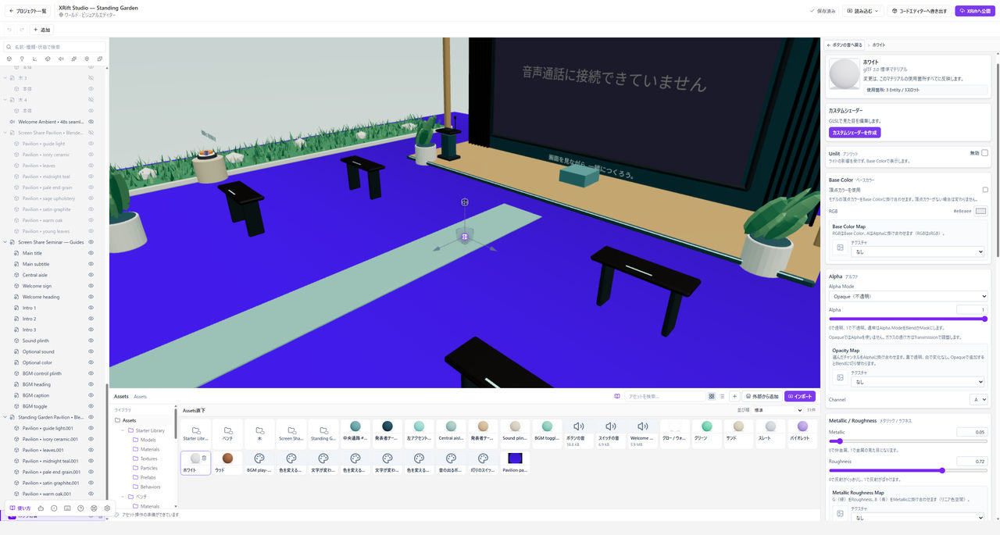

# 半透明・切り抜き・ガラスを作る

**全体を薄く表示するAlpha**と、**ガラスのように光を通すTransmission**は別の設定です。作りたい見た目から選びます。

**始める前に：** [マテリアルの割り当て](./materials.md)を済ませ、Play中ならStopしてください。

*半透明はAlpha ModeをBlendにし、切り抜きはMaskにします。目的に合う方法を選びます。*

## 全体を半透明にする

マテリアルの**Alpha Mode**を**Blend**にし、**Alpha**を下げます。看板の薄い板など、表面全体を薄く表示したいときに使います。

半透明の面がいくつも重なると、描画順によって見え方が不自然になることがあります。面を不必要に重ねないようにし、見る方向を変えて確認してください。

## 葉やフェンスを切り抜く

**Alpha Mode**を**Mask**にし、画像のAlphaと**Alpha Cutoff**で境目を決めます。Alpha Cutoffより小さい部分が切り抜かれます。

輪郭を切り抜くだけなら、全体をBlendにする方法とは区別してください。裏側からも見せる薄い面では、必要に応じて**Double Sided**を確認します。

## 不透明な面に戻す

**Alpha Mode**を**Opaque**にします。**Blending**がNormalならAlphaを使いません。BlendingをNormal以外にすると、Alpha Modeとは別に半透明として描くため、その設定も確認してください。

## ガラスのように光を通す

**Transmission**を有効にします。最初の出発点は**Alpha 1・Alpha Mode Opaque・Metallic 0**です。Transmissionの量を上げ、Roughnessで表面のぼけ方を調整します。

**IOR**は素材本体の屈折率です。Alphaを下げて全体を薄くする方法とは違い、反射と透過を持つ表面として調整します。

## 厚みのある色ガラス

**Volume**で材質の厚みと、通過する光の減衰を調整します。閉じたメッシュを使ってください。

**Attenuation Color**は指定した距離を通ったあとの光の色です。「吸収される光の色」ではありません。**Attenuation Distance**を短くすると、短い距離でその色へ変わります。白では色も明るさも変わりません。

## Opacity Mapを使う

Opacity Mapは不透明度用の画像です。黒で透明、白で変化なしとなり、選んだチャンネルをAlphaとBase Color MapのAへ掛け合わせます。Opaqueの素材へ追加するとBlendへ切り替わります。

これはXRift Studioの追加設定です。ほかのツールの同名項目と、入力画像やチャンネルまで同じとは限りません。
