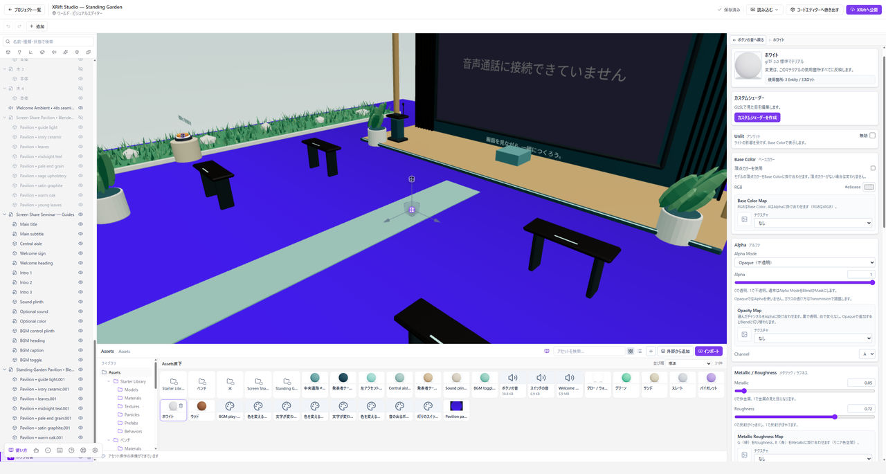

# 半透明・切り抜き・ガラスを作る

全体を半透明に表示するにはAlpha、ガラスのように光を通すにはTransmissionを使います。作りたい見た目に合わせて選んでください。

先に[マテリアルの割り当て](./materials.md)を済ませてください。Play中なら、Stopで編集に戻ります。

*画像は変更前のOpaqueです。半透明にするには、Alpha ModeをBlendにしてください。*

## 全体を半透明にする

Alpha ModeをBlendにし、Alphaを下げてください。看板の薄い板など、表面全体を半透明にしたいときに使えます。

半透明の面が重なると、描画順によって不自然に見える場合があります。不要な重なりを減らし、見る方向を変えて確認してください。

## 葉やフェンスを切り抜く

Alpha ModeをMaskにし、画像のAlphaとAlpha Cutoffで切り抜く境目を設定してください。Alpha Cutoffより小さい部分が切り抜かれます。

輪郭を切り抜く用途にはMaskを使います。薄い面を裏側からも見せる場合は、Double Sidedも確認してください。

## 不透明な面に戻す

Alpha ModeをOpaqueにしてください。BlendingがNormalなら、Alphaは使われません。BlendingがNormal以外の場合は、Alpha Modeにかかわらず半透明で描画されるため、こちらの設定も確認します。

## ガラスのように光を通す

Transmissionを有効にし、Alpha 1、Alpha Mode Opaque、Metallic 0から試してください。Transmissionで透過の量、Roughnessで表面のぼけ方を調整します。

IORは素材本体の屈折率です。Transmissionでは反射と透過を持つ表面を作れます。Alphaを下げて全体を薄く表示する方法とは、見え方が異なります。

## 厚みのある色ガラス

Volumeで、材質の厚みと通過する光の減衰を調整できます。閉じたメッシュを使ってください。

Attenuation Colorは、指定した距離を通過したあとの光の色です。吸収される光の色を指定する設定ではありません。Attenuation Distanceを短くすると、短い距離で指定した色に変わります。Attenuation Colorが白なら、色も明るさも変わりません。

## Opacity Mapを使う

Opacity Mapは、不透明度を調整する画像です。黒の部分は透明になり、白の部分は変わりません。選んだチャンネルの値が、AlphaとBase Color MapのAに掛け合わされます。Opaqueのマテリアルに追加すると、Blendに切り替わります。

Opacity MapはXRift Studioの追加設定です。ほかのツールの同名項目を使う場合は、入力画像やチャンネルの条件も確認してください。
