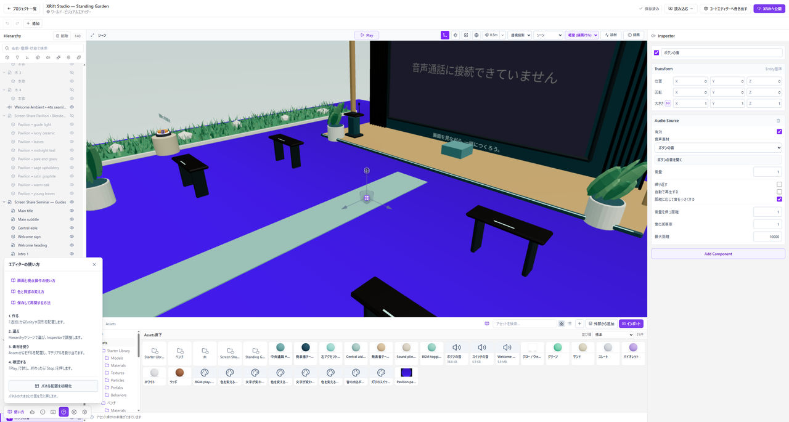

# 困ったときに探す

いま起きている症状を選んでください。**削除や完全リセットを試す前に、保存とバックアップを確認します。**

*パネルが見つからないときは、左下のヘルプからパネル配置を初期化します。*

## アプリを起動できない

[インストールで困ったとき](./installation-problems.md)で、配布ファイル、OS、警告の内容を確認します。

## モデルが見えない

Assetsに取り込んだだけなら、シーンへドラッグして配置します。Hierarchyにあるなら選んで**F**を押し、視点を合わせます。

表示状態、大きさ、位置、読み込みエラーも確認してください。[モデルの取り込み](./assets.md)へ進みます。

## 色や質感が変わらない

Play中なら**Stop**します。編集したマテリアルが対象に割り当てられているか、モデルのスロットを取り違えていないか確認します。

色が全部一緒に変わる場合は、同じマテリアルを共有している可能性があります。[マテリアルの基本](./materials.md)で確認してください。

## 床をすり抜ける

**Stop**し、床のColliderと開始位置を確認します。見える床でも衝突判定がないと立てません。[床と開始位置](./collision.md)へ進みます。

## 空・影・Bloomが見えない

編集画面の表示モードを**シーン**、描画品質を**高品質**に戻して確認します。SkyboxとIBL、EmissiveとBloomは別の設定です。[ライトと明るさ](./lighting.md)を確認してください。

## 音が鳴らない・ボタンが動かない

音声の割り当て、再生の開始条件、音量、聞こえる範囲を確認します。グラフはEntityに付いている必要があります。[音](./audio.md)または[ボタンの仕掛け](./interactivity.md)へ進みます。

## パネルがなくなった

エディター左下のヘルプから**パネル配置を初期化**を使います。作品データを消すリセットとは違います。

## 保存・公開で止まる

保存エラーがある間は、編集画面を閉じずに表示を確認してください。公開の送信結果が不明な場合は、すぐに再送信せずXRiftで状況を確認します。

[保存の手順](./save-and-open.md)、[公開の手順](./publishing.md)、[復旧と問い合わせ](./recovery.md)に、戻り方をまとめています。
