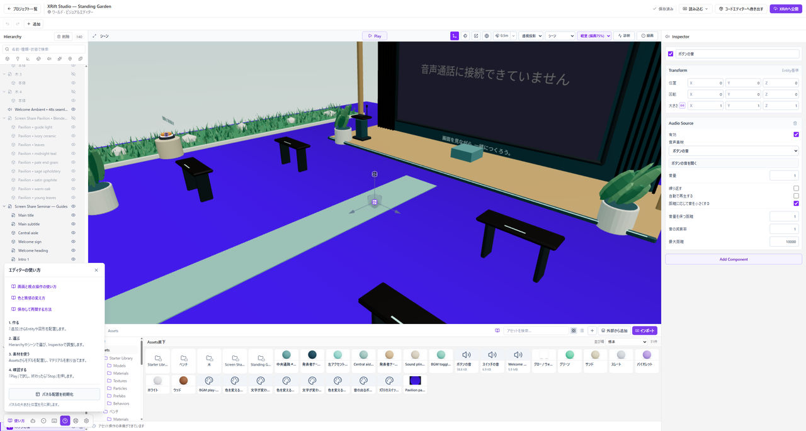

# 困ったときに探す

起きている症状に合う項目を選んでください。削除や完全リセットの前に、保存状態とバックアップを確認してください。

*パネルが見つからない場合は、左下のヘルプで「パネル配置を初期化」を使えます。*

## アプリを起動できない

[インストールで困ったとき](./installation-problems.md)で、配布ファイル、OS、警告の内容を確認してください。

## モデルが見えない

Assetsに取り込んだモデルは、シーンへドラッグして配置してください。すでにHierarchyにある場合は、選んでFを押すと視点を合わせられます。

表示状態、大きさ、位置、読み込みエラーも確認してください。詳しくは[モデルの取り込み](./assets.md)を参照してください。

## 色や質感が変わらない

Play中ならStopで戻ってください。編集したマテリアルが割り当てられているか、変えたい面のスロットを選んでいるかを確認します。

複数のEntityの色が一緒に変わる場合は、同じマテリアルを使っている可能性があります。[マテリアルの基本](./materials.md)を参照してください。

## 床をすり抜ける

Stopで戻り、床のColliderと開始位置を確認してください。床が見えても、Colliderがなければ立てません。設定は[床と開始位置](./collision.md)を参照してください。

## 空・影・Bloomが見えない

編集画面の表示モードを「シーン」、描画品質を「高品質」にして確認してください。SkyboxとIBL、EmissiveとBloomは別の設定です。[ライトと明るさ](./lighting.md)を参照してください。

## 音が鳴らない・ボタンが動かない

音声の割り当て、再生の開始条件、音量、聞こえる範囲を確認してください。グラフは、Entityへの取り付けが必要です。詳しくは[音](./audio.md)か[ボタンの仕掛け](./interactivity.md)を参照してください。

## パネルがなくなった

エディター左下のヘルプから「パネル配置を初期化」を使ってください。作品のデータは削除されません。

## 保存・公開で止まる

保存エラーが出ている間は、編集画面を閉じずに内容を確認してください。公開の送信結果が分からない場合は、再送する前にXRiftで公開状況を確認します。

操作は、[保存の手順](./save-and-open.md)、[公開の手順](./publishing.md)、[復旧と問い合わせ](./recovery.md)を参照してください。
